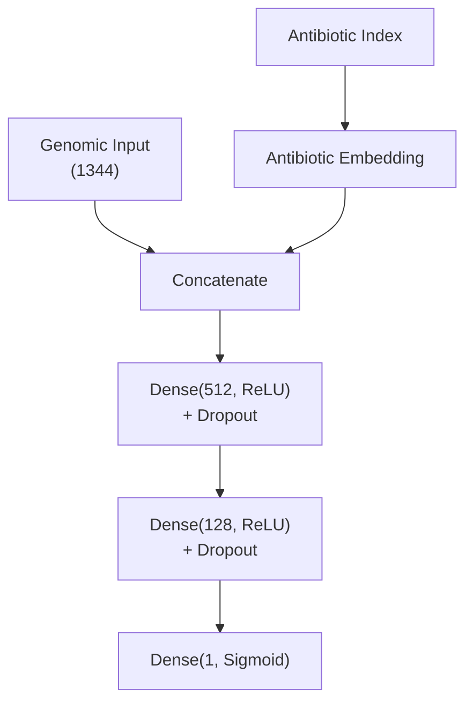
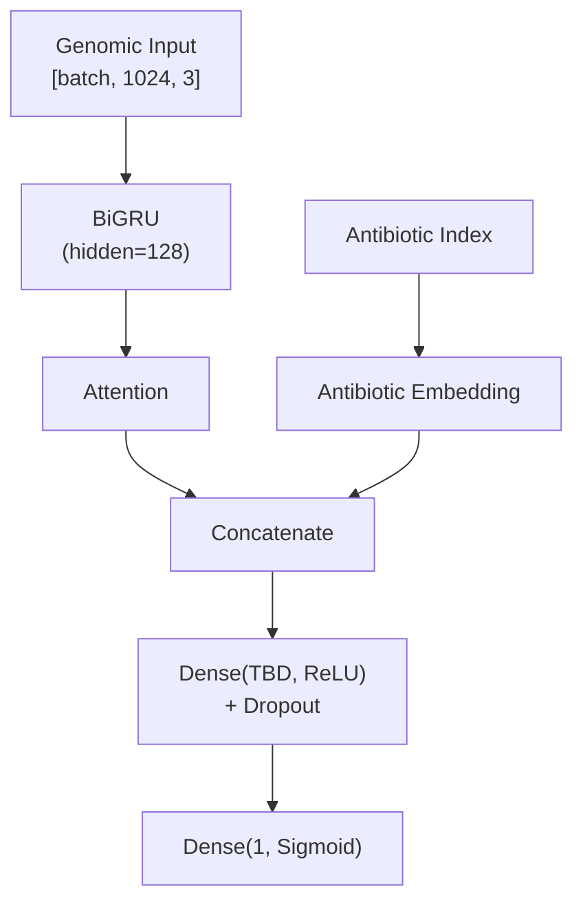
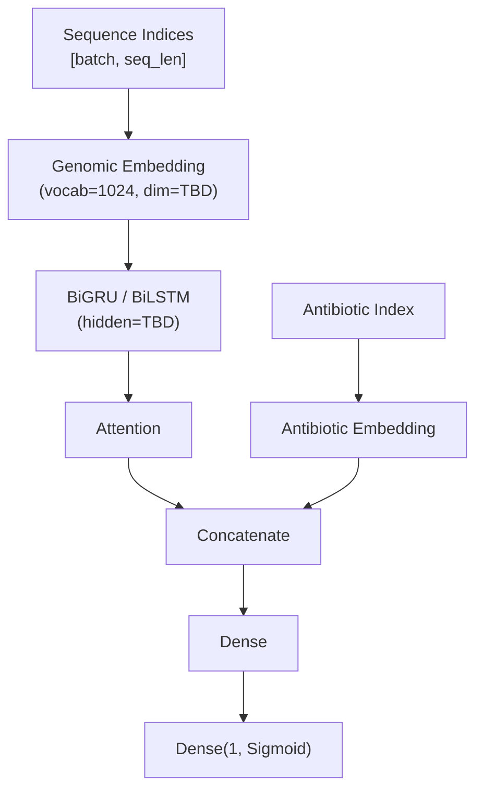

# Models

## Modelo A — MLP (línea de base superficial)

**Nota sobre profundidad:** La arquitectura usa 2 capas ocultas (512 → 128), lo cual
técnicamente supera la definición mínima de "deep" (>1 capa oculta). Sin embargo, la
consideramos superficial en el contexto de este proyecto por dos razones: (1) la propuesta
define "superficial" en contraste con la BiGRU+Attention, que posee capas recurrentes,
mecanismo de atención y mayor capacidad de modelar dependencias secuenciales; (2) en
la literatura de deep learning, redes de 2-3 capas densas se consideran shallow frente a
arquitecturas con decenas o cientos de capas. La segunda capa oculta (128) cumple un rol
de compresión progresiva — reduce la dimensionalidad antes de la capa de salida — y no
introduce la complejidad arquitectónica que distingue a un modelo profundo.

**Entradas:**
- Vector de histograma de k-meros concatenado (1344 dimensiones, normalizado)
- Antibiótico como índice entero → embedding aprendido (dim TBD)

**Arquitectura:**



### Justificación de la arquitectura

La elección de los tamaños de las capas (**1393 → 512 → 128 → 1**) responde a un diseño de **compresión progresiva** (embudo) fundamentado en los siguientes principios:

1. **Capacidad y Generalización (Haykin, Cap. 4.11):** El tamaño de las capas determina la capacidad de la red para extraer estadísticas de orden superior. Un tamaño de 512 neuronas en la primera capa es suficiente para procesar la entrada dispersa de 1393 dimensiones (k-meros + embedding) sin incurrir en una explosión de parámetros que lleve a la memorización del ruido (overfitting).
2. **Jerarquía de Características:** Según Haykin (Cap. 4.13), el uso de dos capas ocultas permite aprender representaciones jerárquicas de forma más eficiente que una sola capa ancha. La capa de 128 neuronas actúa como un cuello de botella (*bottleneck*) que obliga a la red a sintetizar la información más relevante para la resistencia antes de la clasificación final.
3. **Eficiencia Computacional:** Se utilizan potencias de 2 (**512, 128**) para aprovechar las optimizaciones de hardware en GPU (CUDA/cuDNN), que están diseñadas para procesar bloques de datos alineados con estas dimensiones, acelerando el entrenamiento.
4. **Regularización:** Esta arquitectura, combinada con una tasa de **Dropout de 0.3**, garantiza que la capacidad de la red esté equilibrada con respecto al tamaño del dataset (Fase 1), siguiendo la recomendación de Haykin de mantener una relación saludable entre el número de ejemplos y el número de pesos libres.

**Función de pérdida:** Binary Cross-Entropy
**Optimizador:** Adam
**Regularización:** Dropout (tasa 0.3), Early Stopping

#### Comandos CLI

```bash
# Entrenar MLP con hiperparámetros por defecto:
uv run python main.py train-mlp

# Personalizar entrenamiento:
uv run python main.py train-mlp --epochs 50 --batch-size 64 --lr 0.0005 --patience 5

# Especificar rutas de datos y resultados:
uv run python main.py train-mlp --data-dir data/processed --output-dir results/mlp_exp1
```

---

## Modelo B — BiRNN + Attention (modelo profundo)

### Variante A — artículo de referencia (prioridad)

**Entradas:**
- Matriz de histogramas de k-meros (3×1024): k=3,4,5 cada uno paddeado a 1024 → interpretada como 1024 timesteps × 3 features `[batch, 1024, 3]` (nota: el artículo no especifica la orientación explícitamente; esta interpretación se basa en que su modelo procesa secuencias de ~800 residuos con la misma arquitectura — verificar en implementación)
- Antibiótico como índice entero → embedding aprendido (dim TBD)

**Arquitectura:**



### Variante B — secuencia ordenada (extensión futura)

**Entradas:**
- Secuencia ordenada de k-meros (k=5), cada k-mero mapeado a un embedding aprendido (dim TBD, valor inicial sugerido: 100)
- Antibiótico como índice entero → embedding aprendido (dim TBD)

**Arquitectura:**



*Requiere decidir longitud máxima de secuencia (ver doc 2, Variante B)*

**Función de pérdida:** Binary Cross-Entropy
**Optimizador:** Adam
**Regularización:** Dropout, Early Stopping

#### Comandos CLI

```bash
# Entrenar BiGRU (Próximamente):
# uv run python main.py train-bigru
```

---

## Hiperparámetros iniciales (basados en literatura [11][15])
- Embedding dim k-meros: TBD (solo Variante B; valor inicial sugerido 100, sin justificación fuerte)
- Hidden size RNN: 128 (artículo de referencia)
- Dropout: 0.3
- Learning rate: 0.001
- Batch size: 32

## Decisiones pendientes
- [x] GRU vs LSTM → GRU (artículo de referencia; BRNN LSTM y BRNN GRU dieron resultados equivalentes, GRU es más simple)
- [x] Número de capas recurrentes → 1 capa BiGRU (artículo de referencia)
- [x] Tipo de mecanismo de atención → global aditivo / Bahdanau (artículo de referencia)
- [ ] Dimensión del embedding del antibiótico (para ambos modelos) → usar regla empírica `min(50, (num_antibióticos // 2) + 1)`; requiere conocer el número de antibióticos distintos en BV-BRC para ESKAPE con evidencia de laboratorio
- [ ] Cómo manejar longitud variable en Variante B (solo si se implementa — ver doc 2)
