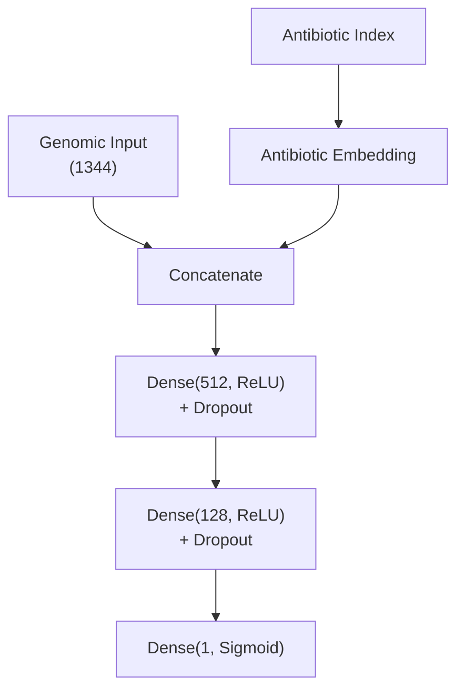
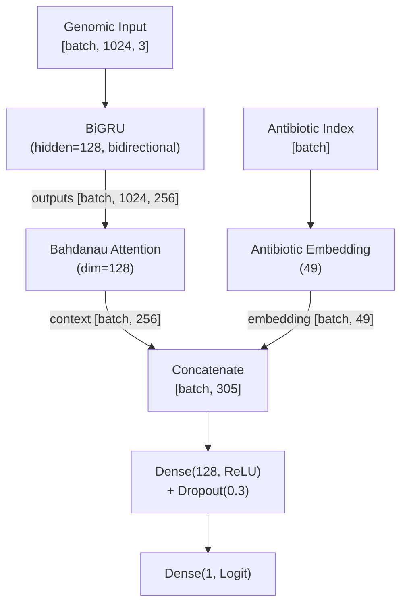
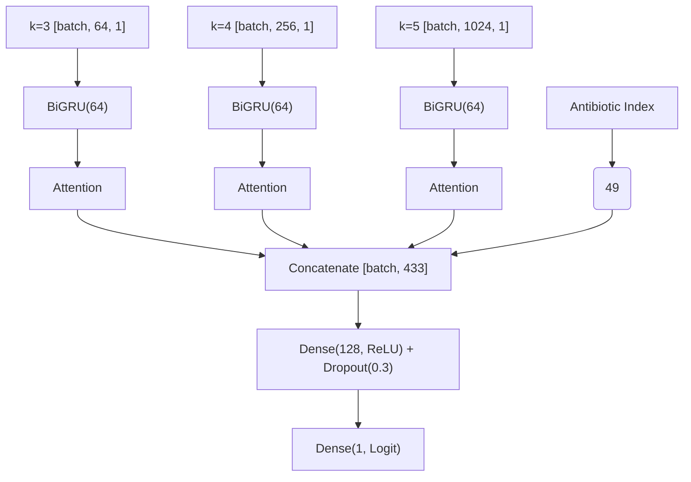
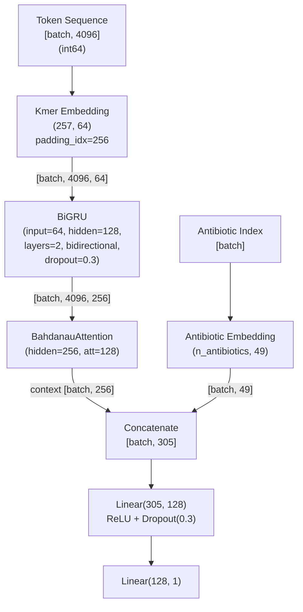

# Models

## Modelo A — MLP (línea de base superficial)

**Nota sobre profundidad:** La arquitectura usa 2 capas ocultas (512 → 128), lo cual
técnicamente supera la definición mínima de "deep" (>1 capa oculta). Sin embargo, la
consideramos superficial en el contexto de este proyecto por dos razones: (1) la propuesta
define "superficial" en contraste con la BiGRU+Attention, que posee capas recurrentes,
mecanismo de atención y mayor capacidad de modelar dependencias secuenciales; (2) en
la literatura de deep learning, redes de 2-3 capas densas se consideran shallow frente a
arquitecturas con decenas o cientos de capas. La segunda capa oculta (128) cumple un rol
de compresión progresiva — reduce la dimensionalidad antes de la capa de salida — y no
introduce la complejidad arquitectónica que distingue a un modelo profundo.

**Entradas:**
- Vector de histograma de k-meros concatenado (1344 dimensiones, normalizado)
- Antibiótico como índice entero → embedding aprendido (dim TBD)

**Arquitectura:**



### Justificación de la arquitectura

La elección de los tamaños de las capas (**1393 → 512 → 128 → 1**) responde a un diseño de **compresión progresiva** (embudo) fundamentado en los siguientes principios:

1. **Capacidad y Generalización (Haykin, Cap. 4.11):** El tamaño de las capas determina la capacidad de la red para extraer estadísticas de orden superior. Un tamaño de 512 neuronas en la primera capa es suficiente para procesar la entrada dispersa de 1393 dimensiones (k-meros + embedding) sin incurrir en una explosión de parámetros que lleve a la memorización del ruido (overfitting).
2. **Jerarquía de Características:** Según Haykin (Cap. 4.13), el uso de dos capas ocultas permite aprender representaciones jerárquicas de forma más eficiente que una sola capa ancha. La capa de 128 neuronas actúa como un cuello de botella (*bottleneck*) que obliga a la red a sintetizar la información más relevante para la resistencia antes de la clasificación final.
3. **Eficiencia Computacional:** Se utilizan potencias de 2 (**512, 128**) para aprovechar las optimizaciones de hardware en GPU (CUDA/cuDNN), que están diseñadas para procesar bloques de datos alineados con estas dimensiones, acelerando el entrenamiento.
4. **Regularización:** Esta arquitectura, combinada con una tasa de **Dropout de 0.3**, garantiza que la capacidad de la red esté equilibrada con respecto al tamaño del dataset (Fase 1), siguiendo la recomendación de Haykin de mantener una relación saludable entre el número de ejemplos y el número de pesos libres.

**Función de pérdida:** Binary Cross-Entropy
**Optimizador:** Adam
**Regularización:** Dropout (tasa 0.3), Early Stopping

#### Comandos CLI

```bash
# Entrenar MLP con hiperparámetros por defecto:
uv run python main.py train-mlp

# Personalizar entrenamiento:
uv run python main.py train-mlp --epochs 50 --batch-size 64 --lr 0.0005 --patience 5

# Especificar rutas de datos y resultados:
uv run python main.py train-mlp --data-dir data/processed --output-dir results/mlp_exp1
```

---

## Modelo B — BiGRU + Attention (modelo profundo)

### Arquitectura — Basada en [Lugo21]

**Entradas:**
- Matriz de histogramas de k-meros (1024×3): k=3,4,5 cada uno paddeado a 1024 → `[batch, 1024, 3]`. Representación distribuida invariante al orden de nodos en FASTA [Lugo21, p. 647].
- Antibiótico como índice entero → embedding aprendido (dim 49).

**Arquitectura:**



### Justificación de la arquitectura

1. **BiGRU (128 unidades):** Basada en [Lugo21]. La bidireccionalidad [Schuster97] captura contexto en ambas direcciones de la secuencia genómica. Las GRU [Cho14] resuelven el problema de dependencias a largo plazo de forma más simple que las LSTM.
2. **Atención Aditiva (Bahdanau):** Implementa el mecanismo de [Bahdanau15] para comprimir los 1024 timesteps en un solo vector de contexto, permitiendo al modelo "enfocarse" en los k-meros más informativos.
3. **Regularización (Dropout 0.3):** Aunque [Lugo21] sugiere 0.5, se redujo a **0.3** tras observar oscilaciones excesivas en el entrenamiento. Un valor de 0.3 es más apropiado para el tamaño de nuestra cabeza clasificadora (305→128→1) [Srivastava14] y mejora la estabilidad de la convergencia.
4. **Gradient Clipping (max_grad_norm=1.0):** Necesario para prevenir el problema de **gradientes explosivos** [Pascanu13] durante la retropropagación a través del tiempo (BPTT) [Haykin, Cap. 15.3] sobre secuencias largas.

### Justificación del Manejo de Desbalance (pos_weight)

El modelo utiliza una variante de **Entropía Cruzada Binaria Ponderada** (Weighted BCE). El parámetro `pos_weight` se calcula dinámicamente como el ratio $N_{susceptible} / N_{resistente}$ y se escala por un factor de **2.5**. Esta decisión se fundamenta en:

1.  **Teoría de la Decisión de Bayes (Haykin, Cap. 1.4):** El umbral óptimo de decisión depende de la relación de costos entre errores. Dado que en AMR un Falso Negativo (FN) es críticamente más peligroso que un Falso Positivo (FP), escalamos la pérdida para penalizar asimétricamente los FN.
2.  **Aprendizaje Sensible al Costo (Cost-Sensitive Learning):** El factor de 2.5 define matemáticamente que omitir un organismo resistente es **2.5 veces más costoso** para el modelo que una falsa alarma. Esto desplaza la frontera de decisión para maximizar el **Recall clínico**.
3.  **Calibración por Objetivos (King & Zeng, 2001):** El valor 2.5 se determinó mediante validación empírica como el multiplicador necesario para satisfacer la restricción técnica de **Recall ≥ 0.90** sin degradar excesivamente la precisión global.

**Función de pérdida:** Binary Cross-Entropy con pesos (`pos_weight`) para desbalance.
**Optimizador:** Adam (lr=0.001) [Kingma15].
**Evaluación:** Umbral calibrado en validación para maximizar F1.

#### Comandos CLI

```bash
# Entrenar BiGRU con hiperparámetros por defecto:
uv run python main.py train-bigru

# Personalizar entrenamiento:
uv run python main.py train-bigru --epochs 50 --batch-size 16 --lr 0.0005
```

---

## Hiperparámetros finales
- **Embedding antibiótico:** 49 dimensiones.
- **Hidden size RNN:** 128 (BiGRU).
- **Dropout:** 0.3 (para ambos modelos).
- **Learning rate:** 0.001 (Adam).
- **Batch size:** 128 (optimizado para GPU).
- **Gradient clipping:** 1.0 (solo BiGRU).
- pos_weight scale: 2.5x (solo BiGRU, para priorizar Recall).
- Early stopping: paciencia 10.

---

## Modelo C — Multi-Stream BiGRU (Arquitectura Experta)

### Arquitectura

Esta arquitectura resuelve la **limitación estructural del padding** detectada en el Modelo B. En lugar de una matriz única, procesa cada resolución de k-mero con un flujo independiente.



### Justificación de la arquitectura

1.  **Eliminación del Padding:** Al procesar k=3, k=4 y k=5 en secuencias separadas, el mecanismo de atención opera exclusivamente sobre información genómica real, evitando que el 86% de la energía se pierda en posiciones con ceros [Ngiam11].
2.  **Streams Expertos:** Cada BiGRU aprende patrones específicos para su tamaño de k-mero. k=3 captura tripletes (codones), mientras que k=5 identifica motivos más largos asociados a determinantes de resistencia.
3.  **Fusión Tardía (Late Fusion):** Siguiendo a [Ngiam11] y [Goodfellow16, Cap. 15], se extraen representaciones comprimidas (vectores de contexto) de cada modalidad antes de concatenarlas, permitiendo que el clasificador aprenda interacciones complejas entre las diferentes resoluciones.
4.  **Eficiencia de Parámetros:** Se reduce el `hidden_size` a 64 por stream para que el conteo total (~233K) sea comparable a la BiGRU base, evitando un aumento excesivo de la complejidad.

#### Comandos CLI

```bash
# Entrenar Multi-Stream BiGRU:
uv run python main.py train-multi-bigru --batch-size 128
```

---

## Modelo D — Token BiGRU (Arquitectura Secuencial Real)

### Arquitectura

Esta arquitectura devuelve la RNN a su uso idiomatíco: procesar una **secuencia real de tokens discretos** (k-meros) preservando su orden y contexto posicional en el genoma [Cho14; Mikolov13].



### Justificación de la arquitectura

1.  **Tokenización y Embedding [Mikolov13]:** En lugar de un histograma (bag-of-words), el genoma se representa como una secuencia de IDs de k-meros (k=4, vocab=256). La capa de embedding mapea estos símbolos a vectores densos de 64 dimensiones donde el modelo puede aprender relaciones biológicas entre k-meros.
2.  **Subsampling Uniforme [Haykin, Cap. 1.2]:** Para manejar genomas de millones de bases, se seleccionan 4096 tokens equidistantes. Esto garantiza una cobertura global del genoma completo sin el sesgo posicional de truncar la secuencia [Lugo21].
3.  **BiGRU Profunda (2 capas) [Cho14; Schuster97]:** La bidireccionalidad permite capturar contexto genómico en ambas direcciones. El uso de **2 capas recurrentes** permite que el modelo aprenda jerarquías de características más complejas (motivos locales -> regiones funcionales) y habilita el uso de **dropout recurrente** entre capas [Srivastava14], fundamental para regularizar secuencias largas de 4096 tokens.
4.  **Interpretabilidad Posicional [Bahdanau15]:** Los pesos de atención `[batch, 4096]` indican qué regiones específicas del genoma (muestreadas) son determinantes para la prediccion, permitiendo mapear la "atención" del modelo de vuelta a coordenadas genómicas reales.

#### Comandos CLI

```bash
# Preparar secuencias de tokens (k=4, max_len=4096):
uv run python main.py prepare-tokens --n-jobs -1

# Entrenar Token BiGRU:
uv run python main.py train-token-bigru --batch-size 32
```

