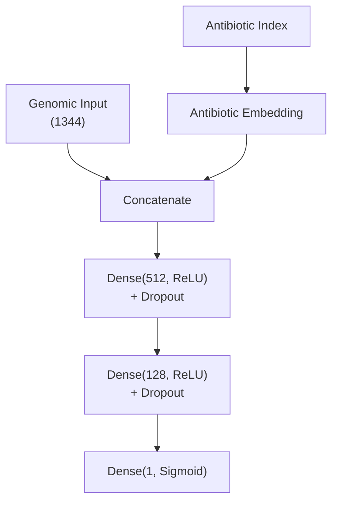
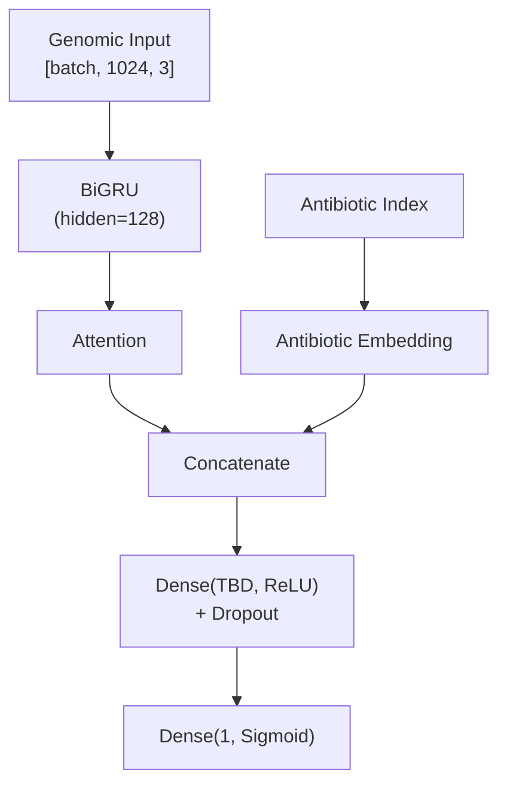
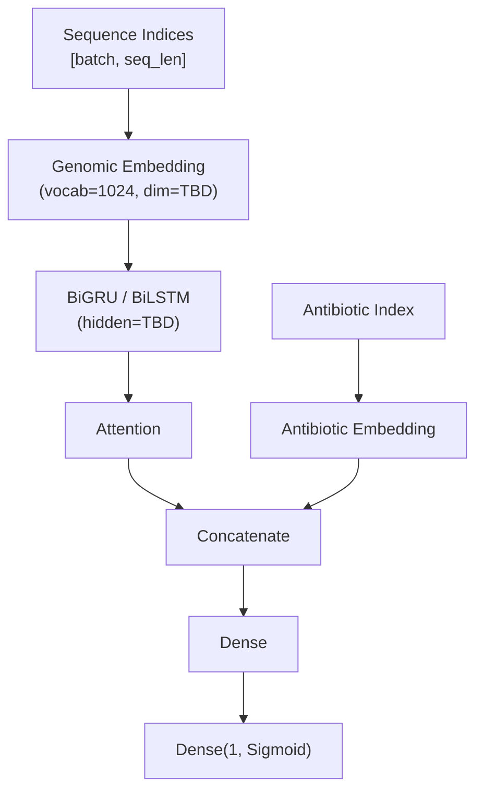

# Models

## Modelo A — MLP (línea de base superficial)

**Entradas:**
- Vector de histograma de k-meros concatenado (1344 dimensiones, normalizado)
- Antibiótico como índice entero → embedding aprendido (dim TBD)

**Arquitectura:**

**Función de pérdida:** Binary Cross-Entropy
**Optimizador:** Adam
**Regularización:** Dropout (tasa TBD), Early Stopping

---

## Modelo B — BiRNN + Attention (modelo profundo)

### Variante A — artículo de referencia (prioridad)

**Entradas:**
- Matriz de histogramas de k-meros (3×1024): k=3,4,5 cada uno paddeado a 1024 → interpretada como 1024 timesteps × 3 features `[batch, 1024, 3]` (nota: el artículo no especifica la orientación explícitamente; esta interpretación se basa en que su modelo procesa secuencias de ~800 residuos con la misma arquitectura — verificar en implementación)
- Antibiótico como índice entero → embedding aprendido (dim TBD)

**Arquitectura:**

### Variante B — secuencia ordenada (extensión futura)

**Entradas:**
- Secuencia ordenada de k-meros (k=5), cada k-mero mapeado a un embedding aprendido (dim TBD, valor inicial sugerido: 100)
- Antibiótico como índice entero → embedding aprendido (dim TBD)

**Arquitectura:**

*Requiere decidir longitud máxima de secuencia (ver doc 2, Variante B)*

**Función de pérdida:** Binary Cross-Entropy
**Optimizador:** Adam
**Regularización:** Dropout, Early Stopping

---

## Hiperparámetros iniciales (basados en literatura [11][15])
- Embedding dim k-meros: TBD (solo Variante B; valor inicial sugerido 100, sin justificación fuerte)
- Hidden size RNN: 128 (artículo de referencia)
- Dropout: 0.3
- Learning rate: 0.001
- Batch size: 32

## Decisiones pendientes
- [x] GRU vs LSTM → GRU (artículo de referencia; BRNN LSTM y BRNN GRU dieron resultados equivalentes, GRU es más simple)
- [x] Número de capas recurrentes → 1 capa BiGRU (artículo de referencia)
- [x] Tipo de mecanismo de atención → global aditivo / Bahdanau (artículo de referencia)
- [ ] Dimensión del embedding del antibiótico (para ambos modelos) → usar regla empírica `min(50, (num_antibióticos // 2) + 1)`; requiere conocer el número de antibióticos distintos en BV-BRC para ESKAPE con evidencia de laboratorio
- [ ] Cómo manejar longitud variable en Variante B (solo si se implementa — ver doc 2)
