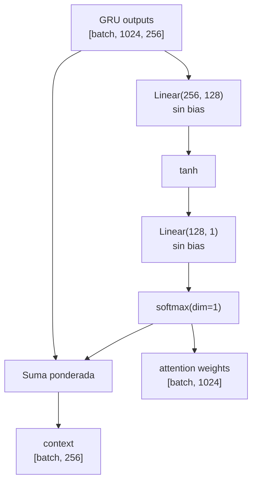
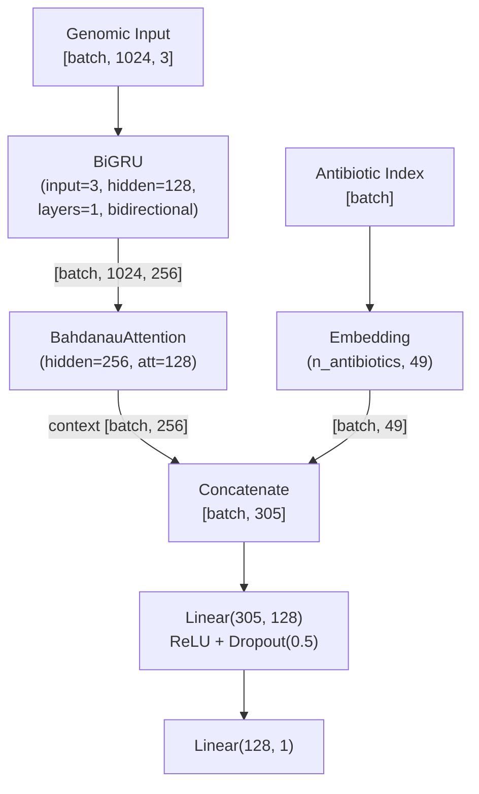

# Plan de Implementación — BiGRU + Atención

## Referencias bibliográficas

Este plan referencia las siguientes fuentes. El código debe incluir comentarios que conecten la implementación con estos conceptos teóricos.

| Ref. | Cita | Relevancia |
|---|---|---|
| [Lugo21] | Lugo, L. & Barreto-Hernández, E. (2021). *A Recurrent Neural Network approach for whole genome bacteria identification*. Applied Artificial Intelligence, 35(9), 642–656. | **Artículo de referencia principal.** Define la arquitectura BiGRU+Attention con k-meros, GRU 128, atención global, y representación distribuida 3×1024. Ver `docs/reference/reference_article.pdf`. |
| [Haykin] | Haykin, S. (2009). *Neural Networks and Learning Machines*, 3ª ed. Pearson. | Texto base del curso: RNNs (Cap. 15), generalización (Cap. 4.11), regularización (Cap. 4.14), retropropagación (Cap. 4.4), BPTT (Cap. 15.3). |
| [Cho14] | Cho, K. et al. (2014). *Learning Phrase Representations using RNN Encoder-Decoder for Statistical Machine Translation*. EMNLP. | Artículo original de la unidad GRU: compuertas de actualización y reinicio. Citado por [Lugo21]. |
| [Bahdanau15] | Bahdanau, D., Cho, K. & Bengio, Y. (2015). *Neural Machine Translation by Jointly Learning to Align and Translate*. ICLR. | Mecanismo de atención aditiva. Citado por [Lugo21] como base del mecanismo de atención. |
| [Luong15] | Luong, M., Pham, H. & Manning, C. (2015). *Effective Approaches to Attention-based Neural Machine Translation*. EMNLP. | Atención multiplicativa ("general content-based score"). [Lugo21] implementa este tipo de score. |
| [Schuster97] | Schuster, M. & Paliwal, K. (1997). *Bidirectional Recurrent Neural Networks*. IEEE Trans. Signal Processing. | Fundamento de la bidireccionalidad: procesar secuencias en ambas direcciones. |
| [Goodfellow16] | Goodfellow, I., Bengio, Y. & Courville, A. (2016). *Deep Learning*. MIT Press. | RNNs y BPTT (Cap. 10), regularización (Cap. 7), optimización (Cap. 8), gradientes explosivos (Cap. 10.7). |
| [Pascanu13] | Pascanu, R. et al. (2013). *On the Difficulty of Training Recurrent Neural Networks*. ICML. | Problema de gradientes explosivos en RNNs → justifica gradient clipping. |
| [Srivastava14] | Srivastava, N. et al. (2014). *Dropout: A Simple Way to Prevent Neural Networks from Overfitting*. JMLR. | Fundamento teórico del dropout como regularización. |
| [Kingma15] | Kingma, D. & Ba, J. (2015). *Adam: A Method for Stochastic Optimization*. ICLR. | Optimizador Adam. Citado por [Lugo21]. |
| [Graves12] | Graves, A. (2012). *Supervised Sequence Labelling with Recurrent Neural Networks*. Ph.D. thesis. | Sequence labeling, contexto en RNNs. Citado extensamente por [Lugo21]. |

---

## Convención de comentarios en el código

El código debe incluir **comentarios explicativos en español** que conecten la implementación con los conceptos teóricos, siguiendo el estilo del MLP existente (`src/mlp_model.py`, `src/train/loop.py`). Específicamente:

1. **Docstrings de clase:** Describir qué representa la clase, su arquitectura, y referenciar las fuentes teóricas con las etiquetas de la tabla anterior (e.g., "[Bahdanau15]", "[Haykin, Cap. 15]", "[Lugo21, Fig. 2]").
2. **Docstrings de métodos:** Explicar el flujo de datos con shapes de tensores y la conexión con el concepto teórico que implementa.
3. **Comentarios inline:** En cada paso no trivial del forward pass, explicar *por qué* se hace la operación, referenciando la ecuación, figura o concepto correspondiente. Ejemplo:
   ```python
   # Atención aditiva [Bahdanau15, Eq. 6]: e_t = v_a^T · tanh(W_a · h_t)
   # Calcula la "energía" de cada timestep — cuánta información relevante
   # contiene para la predicción de resistencia.
   energy = self.v_a(torch.tanh(self.W_a(gru_outputs)))
   ```
4. **Constantes:** Justificar cada valor con su origen (artículo, decisión de diseño, convención). Ejemplo:
   ```python
   GRU_HIDDEN_SIZE = 128  # [Lugo21, p. 648]: "a bidirectional GRU hidden layer with 128 units"
   ```
5. **Conexiones Haykin:** Donde el código implemente un concepto del libro de texto, referenciarlo para el contexto académico del proyecto.

---

## Archivos a crear/modificar

| Archivo | Acción |
|---|---|
| `src/bigru_model.py` | Nuevo — `BahdanauAttention` + `AMRBiGRU` |
| `src/dataset.py` | Modificar — agregar parámetro `model_type` |
| `src/train/loop.py` | Modificar — agregar soporte para gradient clipping (opcional) |
| `main.py` | Agregar comando `train-bigru` |
| `tests/test_bigru.py` | Nuevo — tests unitarios del modelo BiGRU+Attention |
| `tests/test_dataset.py` | Modificar — test de carga con `model_type="bigru"` |

---

## 1. Dataset (`src/dataset.py` — modificación)

Modificar la clase `AMRDataset` para soportar ambos formatos de entrada (MLP y BiGRU) mediante un parámetro `model_type`.

**Cambio en el constructor:**
- Agregar parámetro `model_type: str = "mlp"` a `__init__`
- Cuando `model_type == "bigru"`, cargar los `.npy` desde el subdirectorio `bigru/` en lugar de `mlp/`
- La forma del tensor cambia de `(1344,)` a `(1024, 3)`, pero esto es transparente para el resto del código porque el DataLoader simplemente apila los tensores en un batch

**Cambio concreto en `__init__`:**
- Línea 60 actual: `mlp_dir = data_dir / "mlp"` se reemplaza por lógica condicional:
  ```python
  # Seleccionar subdirectorio según el tipo de modelo [Lugo21, p. 647]:
  # - "mlp": vectores 1D (1344,) — "a concatenated vector of only 1344 positions"
  # - "bigru": matrices 2D (1024, 3) — "padded with zero to the length of the
  #   largest histogram and stacked into a matrix of 3 × 1024"
  if model_type not in ("mlp", "bigru"):
      raise ValueError(f"model_type debe ser 'mlp' o 'bigru', recibido: '{model_type}'")
  self._model_type = model_type
  vectors_dir = data_dir / model_type
  ```
- **Nota sobre tipo de dato:** Los `.npy` de BiGRU están almacenados en `float64` (numpy default), pero `torch.from_numpy(vec).float()` los convierte a `float32` automáticamente, igual que para MLP.

**Lo que NO cambia:** `__getitem__`, `__len__`, `load_pos_weight`, lógica de splits/labels/antibiotic_index. El 95% del código permanece idéntico.

**Conexión teórica:** La representación distribuida de k-meros como matriz `[1024, 3]` sigue el diseño de [Lugo21, p. 647]: "The distributed representation provides contextual information and helps to deal with high dimensionality in the sequences." Esto refleja la **Representación del Conocimiento** [Haykin, Cap. 7]: los mismos datos biológicos se pueden codificar de formas distintas según la arquitectura que los consumirá. La ventaja de la representación distribuida es su **invarianza al orden de los nodos** en el FASTA [Lugo21, p. 647], lo que es crucial porque los contigs/scaffolds en un archivo FASTA no están necesariamente ordenados.

---

## 2. Modelo (`src/bigru_model.py`)

Dos clases: `BahdanauAttention` (mecanismo de atención) y `AMRBiGRU` (modelo completo).

### 2.1 Constantes del módulo

```python
# Embedding de antibiótico — regla empírica min(50, (n//2)+1) con 96 antibióticos
ANTIBIOTIC_EMBEDDING_DIM = 49    # ver docs/2_eda.md

# Hiperparámetros de la BiGRU [Lugo21, p. 648]:
# "a bidirectional GRU hidden layer with 128 units"
GRU_INPUT_SIZE = 3               # 3 features por timestep (k=3,4,5) [Lugo21, p. 647]
GRU_HIDDEN_SIZE = 128            # [Lugo21, p. 648]
GRU_NUM_LAYERS = 1               # [Lugo21, p. 648]: una sola capa recurrente
GRU_OUTPUT_DIM = GRU_HIDDEN_SIZE * 2  # 256 — forward + backward [Schuster97]

# Atención [Bahdanau15] / [Luong15]
ATTENTION_DIM = 128              # dimensión interna del espacio de atención

# Clasificador
CLASSIFIER_HIDDEN = 128          # capa densa tras concatenación

# Regularización [Lugo21, p. 651]: "Dropout of 0.5 provides regularization
# for the two dense layers"
DROPOUT = 0.5
```

> **Nota sobre dropout:** [Lugo21] usa 0.5, mientras que `docs/4_models.md` sugiere 0.3 (valor heredado del MLP). Se adopta **0.5** para alinearse con el artículo de referencia, ya que la BiGRU tiene más parámetros y mayor riesgo de overfitting que el MLP. Esto es consistente con la recomendación original de [Srivastava14] de 0.5 como valor por defecto, y con la teoría de [Haykin, Cap. 4.14] sobre regularización proporcional a la capacidad del modelo.

### 2.2 Nota sobre el tipo de atención

[Lugo21] referencia tanto a [Bahdanau15] como a [Luong15], describiendo su mecanismo como "global attention with general content-based score" (p. 648, terminología de [Luong15]) pero también citando a [Bahdanau15] como base (p. 651, 654). En nuestro `docs/4_models.md` se decidió usar **atención Bahdanau (aditiva)**, lo cual mantenemos por:

1. La atención aditiva [Bahdanau15] es más expresiva que la multiplicativa [Luong15] al introducir una no linealidad (tanh) que permite capturar relaciones no lineales entre estados ocultos.
2. Para secuencias largas (1024 timesteps), la atención aditiva suele ser más estable numéricamente [Goodfellow16, Cap. 10].
3. [Lugo21] trata ambos mecanismos como intercambiables en su contexto, y los resultados del artículo de referencia no aíslan el efecto del tipo de atención.

### 2.3 `BahdanauAttention(nn.Module)`

Implementa el mecanismo de atención aditiva [Bahdanau15], que calcula un vector de contexto como suma ponderada de los estados ocultos de la BiGRU.



**Constructor:** `__init__(self, hidden_dim: int, attention_dim: int)`
- `self.W_a = nn.Linear(hidden_dim, attention_dim, bias=False)` — proyección de estados ocultos al espacio de atención
- `self.v_a = nn.Linear(attention_dim, 1, bias=False)` — vector de contexto aprendido que produce el score escalar

**Forward:** `forward(self, gru_outputs: Tensor) -> tuple[Tensor, Tensor]`

Implementa las ecuaciones de [Bahdanau15, §A.1.2]:

1. `energy = self.v_a(torch.tanh(self.W_a(gru_outputs)))` — $e_t = v_a^\top \tanh(W_a h_t)$ — `[batch, 1024, 1]`
2. `energy = energy.squeeze(-1)` — `[batch, 1024]`
3. `alpha = F.softmax(energy, dim=1)` — $\alpha_t = \text{softmax}(e_t)$ — pesos de atención normalizados `[batch, 1024]`
4. `context = torch.bmm(alpha.unsqueeze(1), gru_outputs).squeeze(1)` — $c = \sum_t \alpha_t h_t$ — `[batch, 256]`
5. Retorna `(context, alpha)`

**Conexión teórica:**
- El mecanismo de atención implementa una forma de **Selección Competitiva** [Haykin, Cap. 9.7] donde los timesteps compiten por la relevancia.
- La función softmax crea una **distribución de probabilidad** [Goodfellow16, Cap. 6.2.2.3] que asigna pesos normalizados sobre los 1024 timesteps.
- Desde la **Teoría de la Información** [Haykin, Cap. 1.6]: la atención maximiza la información mutua entre la representación comprimida (vector de contexto) y la entrada.
- [Lugo21, p. 648]: "The attention mechanism creates a context vector $c_t$ from a weighted combination of intermediate hidden states $h_t$" — nuestro `context` corresponde a este $c_t$.
- [Bahdanau15] demostró que este mecanismo supera a los modelos encoder-decoder sin atención al permitir al modelo "mirar atrás" a toda la secuencia de entrada, lo que [Graves12] describe como captura de **información contextual** en sequence labeling.

### 2.4 `AMRBiGRU(nn.Module)`

Arquitectura basada en [Lugo21, Fig. 2, p. 651]:



**Constructor:** `__init__(self, n_antibiotics: int)`
- `self.antibiotic_embedding = nn.Embedding(n_antibiotics, ANTIBIOTIC_EMBEDDING_DIM)`
- `self.gru = nn.GRU(...)` — [Cho14]: la GRU usa compuertas de actualización ($z_t$) y reinicio ($r_t$) para controlar el flujo de información. [Lugo21, p. 646]: "GRUs are motivated by LSTMs but are simpler to compute and implement." Bidireccional [Schuster97] para capturar contexto en ambas direcciones.
  - `input_size=3`: las 3 columnas del histograma (k=3, k=4, k=5) [Lugo21, p. 647]
  - `hidden_size=128`: [Lugo21, p. 648]
  - `num_layers=1`: una sola capa recurrente; el dropout interno de `nn.GRU` solo aplica entre capas, por lo que no tiene efecto con 1 capa
  - `bidirectional=True`, `batch_first=True`
- `self.attention = BahdanauAttention(hidden_dim=GRU_OUTPUT_DIM, attention_dim=ATTENTION_DIM)`
- `self.classifier = nn.Sequential(...)` — [Lugo21, p. 648/651]: "a dense layer to concatenate the context vector to the final output state – and a dense layer for classification. Dropout of 0.5 provides regularization for the two dense layers."
  - `Linear(305, 128)` — 305 = 256 (atención) + 49 (antibiótico embedding)
  - `ReLU()` — no linealidad [Haykin, Cap. 4.1]
  - `Dropout(0.5)` — [Lugo21, p. 651], [Srivastava14]
  - `Linear(128, 1)` — logit de salida (sin sigmoid; usar `BCEWithLogitsLoss`)
- `self._attention_weights: Tensor | None = None` — atributo para almacenar pesos de atención para análisis posterior

**Forward:** `forward(self, genome: Tensor, antibiotic_idx: Tensor) -> Tensor`
1. `gru_out, _ = self.gru(genome)` — `[batch, 1024, 256]` — BiGRU procesa la secuencia en ambas direcciones [Schuster97], concatenando estados ocultos forward y backward. [Lugo21, p. 646]: "bidirectional RNNs were created to cope with [...] sequence analysis requirements"
2. `context, attn_weights = self.attention(gru_out)` — `[batch, 256]`, `[batch, 1024]` — atención comprime la secuencia en un vector de contexto [Bahdanau15; Lugo21, p. 648]
3. `self._attention_weights = attn_weights.detach()` — almacenar para análisis posterior (`.detach()` evita retener el grafo de gradientes en memoria [Goodfellow16, Cap. 6.5.6])
4. `ab_emb = self.antibiotic_embedding(antibiotic_idx)` — `[batch, 49]`
5. `x = torch.cat([context, ab_emb], dim=1)` — `[batch, 305]` — fusión multimodal: [Lugo21, p. 648]: "a dense layer to concatenate the context vector to the final output state"
6. `return self.classifier(x)` — `[batch, 1]`

**Factory method:** `from_antibiotic_index(cls, path: str) -> "AMRBiGRU"` — idéntico al patrón de AMRMLP

**Nota sobre `_attention_weights`:** Se almacenan como atributo del modelo (no como salida del forward) para mantener la **interfaz `forward(genome, antibiotic_idx) → logits`** que el training loop genérico (`src/train/loop.py`) espera. Tras una pasada de inferencia, los pesos se pueden acceder vía `model._attention_weights` para el análisis del Experimento 2 (docs/5_experiments.md: "registrar pesos de atención para analizar qué k es más informativo").

**Justificación del tamaño de la capa densa (305 → 128 → 1):** El patrón de **compresión progresiva** (embudo) se mantiene del MLP. La entrada de 305 dimensiones (256 de atención + 49 de embedding) se reduce a 128, coincidiendo con el hidden_size del GRU. Esto sigue el **principio de cuello de botella de información** [Goodfellow16, Cap. 14.4]: forzar una representación compacta antes de la decisión ayuda a la generalización.

**Inicialización de pesos:** [Lugo21, p. 648] usa $w_0 = \mathcal{N}(0, 0.1)$ para inicializar los pesos. PyTorch inicializa las capas GRU con distribución uniforme por defecto. Considerar agregar inicialización explícita si los resultados lo ameritan, pero no como primera iteración — la inicialización por defecto de PyTorch (Glorot/He según la capa) es generalmente adecuada [Goodfellow16, Cap. 8.4].

**Conexión teórica:**
- La BiGRU implementa una **Red Neuronal Recurrente** [Haykin, Cap. 15] con compuertas [Cho14] que resuelven el problema de **dependencias a largo plazo** [Goodfellow16, Cap. 10.7].
- La bidireccionalidad [Schuster97] permite capturar contexto tanto pasado como futuro, lo que [Lugo21, p. 646] describe como esencial para sequence labeling: "context information is available from one side of the sequence [...] bidirectional RNNs were created to cope with those sequence analysis requirements."
- [Graves12]: Las RNNs son ideales para sequence labeling porque "store information from input sequences by using iterative function loops" — almacenan contexto de forma flexible.
- El modelo completo sigue la arquitectura de [Lugo21, Fig. 2]: codificación k-meros → BiGRU → atención → clasificación.

---

## 3. Gradient Clipping (`src/train/loop.py` — modificación)

Las redes recurrentes son susceptibles al problema de **gradientes explosivos** [Pascanu13]: durante la retropropagación a través del tiempo (BPTT) [Haykin, Cap. 15.3], los gradientes pueden crecer exponencialmente al multiplicarse por la misma matriz de pesos en cada timestep [Goodfellow16, Cap. 10.7]. Con 1024 timesteps, este riesgo es significativo.

**Solución:** Agregar un parámetro opcional `max_grad_norm` a `train_epoch()` y `train()`.

**Cambio en `train_epoch`:**
```python
def train_epoch(
    model, loader, optimizer, criterion, device,
    max_grad_norm: float | None = None,   # ← nuevo parámetro
) -> float:
    ...
    loss.backward()

    # Gradient clipping [Pascanu13]: limita la norma L2 del gradiente
    # global para prevenir la explosión de gradientes en redes recurrentes.
    # Con BPTT [Haykin, Cap. 15.3] sobre 1024 timesteps, los gradientes
    # pueden crecer exponencialmente sin esta protección [Goodfellow16, Cap. 10.7].
    if max_grad_norm is not None:
        torch.nn.utils.clip_grad_norm_(model.parameters(), max_grad_norm)

    optimizer.step()
    ...
```

**Cambio en `train`:**
```python
def train(
    model, train_loader, val_loader, test_loader, criterion, device,
    *, lr=0.001, epochs=100, patience=10,
    output_dir="results/mlp",
    max_grad_norm: float | None = None,  # ← nuevo parámetro
) -> dict:
    ...
    train_loss = train_epoch(model, train_loader, optimizer, criterion, device,
                             max_grad_norm=max_grad_norm)
```

- `max_grad_norm=None` (default): sin clipping → **no afecta el MLP existente ni sus tests**
- `max_grad_norm=1.0`: valor estándar para RNNs [Pascanu13], usado en el comando `train-bigru`
- **Retrocompatibilidad:** La firma anterior sigue funcionando sin cambios porque el parámetro es opcional con default `None`.

---

## 4. Entrenamiento

**Parámetros basados en [Lugo21], con gradient clipping adicional:**
- Optimizador: Adam lr=0.001 [Kingma15; Lugo21, p. 649]
- Loss: `BCEWithLogitsLoss(pos_weight=...)` — mismo `pos_weight` de `train_stats.json` [Haykin, Cap. 1.4]
- Early stopping: patience=10 sobre val_loss [Haykin, Cap. 4.13; Goodfellow16, Cap. 7.8]
- Checkpoint: mejor val F1
- Max epochs: 100
- Batch size: 32 (nota: [Lugo21] usa 128, pero nuestro dataset es más pequeño)
- **Gradient clipping: `max_grad_norm=1.0`** [Pascanu13] — necesario para BiGRU

**Consideración de memoria:** La BiGRU con 1024 timesteps consume significativamente más VRAM que el MLP (estados ocultos de `[batch, 1024, 256]` + grafos de gradientes para BPTT). Si batch_size=32 causa OOM (Out of Memory):
- Reducir a `--batch-size 16` como primera opción
- Esto no debería afectar significativamente la convergencia [Goodfellow16, Cap. 8.1.3], aunque puede requerir ajustar el learning rate proporcionalmente

**Outputs en `results/bigru/`:**
- `best_model.pt` — checkpoint con mejor val F1
- `metrics.json` — métricas finales sobre test set
- `history.csv` — métricas por época
- `history.png` — curvas de loss y F1 vs epochs

**Conexión teórica:** El reuso del mismo ciclo de entrenamiento para ambos modelos demuestra la universalidad del **Algoritmo de Retropropagación** [Haykin, Cap. 4.4]: independientemente de la arquitectura, el aprendizaje supervisado sigue el mismo paradigma. En el caso de la BiGRU, PyTorch implementa internamente la **Retropropagación a Través del Tiempo / BPTT** [Haykin, Cap. 15.3; Goodfellow16, Cap. 10.2.2], desenrollando la red recurrente para calcular gradientes a lo largo de los 1024 timesteps. El gradient clipping [Pascanu13] es la contramedida estándar al problema de gradientes explosivos que emerge de este desenrollamiento.

---

## 5. CLI (`main.py`)

Nuevo comando `train-bigru` siguiendo el patrón exacto de `train-mlp` (líneas 228–299).

**Cambios respecto a `train-mlp`:**
1. Import de `AMRBiGRU` desde `bigru_model`
2. Instanciación del dataset con `model_type="bigru"`:
   ```python
   train_ds = AMRDataset(data_dir, split="train", model_type="bigru")
   ```
3. Instanciación del modelo:
   ```python
   model = AMRBiGRU.from_antibiotic_index(str(data_dir / "antibiotic_index.csv"))
   ```
4. Default de `output_dir`: `Path("results/bigru")`
5. Pasar `max_grad_norm=1.0` a `run_training()`
6. Docstring y help actualizados para referenciar BiGRU+Attention

**Mismos argumentos CLI:**
- `--data-dir` (default: `data/processed`)
- `--output-dir` (default: `results/bigru`)
- `--epochs` (default: 100)
- `--batch-size` (default: 32)
- `--lr` (default: 0.001)
- `--patience` (default: 10)

**Actualizar el docstring del módulo** (líneas 1–18 de `main.py`) para incluir `train-bigru` en la lista de comandos.

---

## 6. Tests (`tests/test_bigru.py`)

Seguir el patrón exacto de `tests/test_mlp.py` con tests adicionales para atención.

| Test | Descripción |
|---|---|
| `test_output_shape` | `[batch, 1]` para batch sizes 1, 4, 32 con input `[batch, 1024, 3]` |
| `test_output_is_unbounded_logits` | Logits sin sigmoid (pueden ser < 0 o > 1) |
| `test_dropout_inactive_in_eval` | Salida determinista en `model.eval()` |
| `test_dropout_active_in_train` | Salida variable en `model.train()` |
| `test_attention_weights_shape` | `model._attention_weights.shape == [batch, 1024]` tras forward |
| `test_attention_weights_sum_to_one` | `attention_weights.sum(dim=1)` ≈ 1.0 para cada muestra (softmax) |
| `test_from_antibiotic_index` | Factory method lee CSV y crea modelo con n_antibiotics correcto |
| `test_embedding_dim` | Embedding tiene dimensión `ANTIBIOTIC_EMBEDDING_DIM` (49) |

**Fixture:**
```python
_N_ANTIBIOTICS = 10

@pytest.fixture()
def model():
    return AMRBiGRU(n_antibiotics=_N_ANTIBIOTICS)
```

**Input de test:** `genome = torch.randn(batch_size, 1024, 3)` (a diferencia del MLP que usa `torch.randn(batch_size, 1344)`)

**Conexión teórica:** Los tests de la suma de pesos de atención verifican que el softmax produce una **distribución de probabilidad válida** [Goodfellow16, Cap. 6.2.2.3], requisito fundamental para que el mecanismo de atención [Bahdanau15] funcione como selección competitiva [Haykin, Cap. 9.7]. Los tests de logits sin acotar aseguran la **diferenciabilidad** [Haykin, Cap. 4.1] de la función de red.

### Modificación a `tests/test_dataset.py`

Agregar test para verificar que `model_type="bigru"` carga tensores con shape `(1024, 3)` en lugar de `(1344,)`. Requiere un fixture que cree archivos `.npy` temporales en un subdirectorio `bigru/`.

### Modificación a `tests/test_train.py`

Agregar test para verificar que `max_grad_norm` funciona:
- Con `max_grad_norm=1.0`, la norma del gradiente tras `loss.backward()` + clipping no excede 1.0
- Sin `max_grad_norm` (default `None`), el comportamiento existente no cambia

---

## Decisiones fijas

| Parámetro | Valor | Origen | Justificación teórica |
|---|---|---|---|
| Input genómico | `[1024, 3]` | [Lugo21, p. 647]: "padded [...] and stacked into a matrix of 3 × 1024" | **Representación distribuida** [Lugo21]: invariante al orden de nodos en FASTA; captura contexto de múltiples k. |
| Embedding antibiótico | 49 dims | `min(50, (96//2)+1)` — EDA | **Invarianza** [Haykin, Cap. 7.1]: Mapeo de categorías a espacio continuo. |
| GRU hidden size | 128 | [Lugo21, p. 648]: "128 units" | **Red Recurrente** [Cho14; Haykin, Cap. 15]: Capacidad para codificar patrones temporales. |
| GRU capas | 1 | [Lugo21, p. 648] | **Parsimonia** [Haykin, Cap. 4.11]: 1 capa bidireccional → 256 dims sin riesgo de desvanecimiento [Goodfellow16, Cap. 10.7]. |
| Bidireccional | Sí | [Lugo21, p. 646; Schuster97] | **Contexto bidireccional** [Schuster97; Graves12]: Dependencias en ambas direcciones de la secuencia. |
| Atención | Bahdanau (aditiva) | [Bahdanau15]; docs/4_models.md | **Atención aditiva** [Bahdanau15]: No linealidad vía tanh; estable para secuencias largas. Nota: [Lugo21] cita tanto [Bahdanau15] como [Luong15]. |
| Dimensión atención | 128 | simetría con GRU hidden | **Codificación Eficiente** [Haykin, Cap. 1.5]: Espacio latente para discriminar relevancia por timestep. |
| Capa densa | 305 → 128 → 1 | compresión progresiva; [Lugo21, p. 648] | **Cuello de botella** [Goodfellow16, Cap. 14.4]: Representación compacta antes de la decisión. |
| Dropout | 0.5 | [Lugo21, p. 651]: "Dropout of 0.5" | **Regularización** [Srivastava14; Haykin, Cap. 4.14]: Mayor que MLP (0.3) por mayor capacidad del modelo. |
| Gradient clipping | `max_grad_norm=1.0` | [Pascanu13] | **Gradientes explosivos** [Pascanu13; Goodfellow16, Cap. 10.7]: Limitar norma L2 en BPTT sobre 1024 timesteps. |
| Optimizador | Adam lr=0.001 | [Kingma15; Lugo21, p. 649] | **Optimización adaptativa** [Kingma15]: Tasas de aprendizaje por parámetro. |
| Batch size | 32 | docs/5_experiments.md | **Mini-batch SGD** [Goodfellow16, Cap. 8.1.3]. Nota: [Lugo21] usa 128. |
| Loss | `BCEWithLogitsLoss` + pos_weight | AGENTS.md | **Teoría de Bayes** [Haykin, Cap. 1.4]: Riesgo promedio ante desbalance. |
| Early stopping | patience=10, val loss | AGENTS.md | **Generalización** [Haykin, Cap. 4.11; Goodfellow16, Cap. 7.8]: Evitar memorización. |
| Mejor modelo | mayor val F1 | AGENTS.md | **Reconocimiento de Patrones** [Haykin, Cap. 9]: Utilidad clínica. |
| Semilla | 42 | AGENTS.md | **Reproducibilidad** [Haykin, Cap. 4.4]: Consistencia en la convergencia. |
| Almacenamiento atención | atributo `_attention_weights` | docs/5_experiments.md | **Interpretabilidad** [Lugo21, p. 648]: Analizar qué k es más informativo. |
