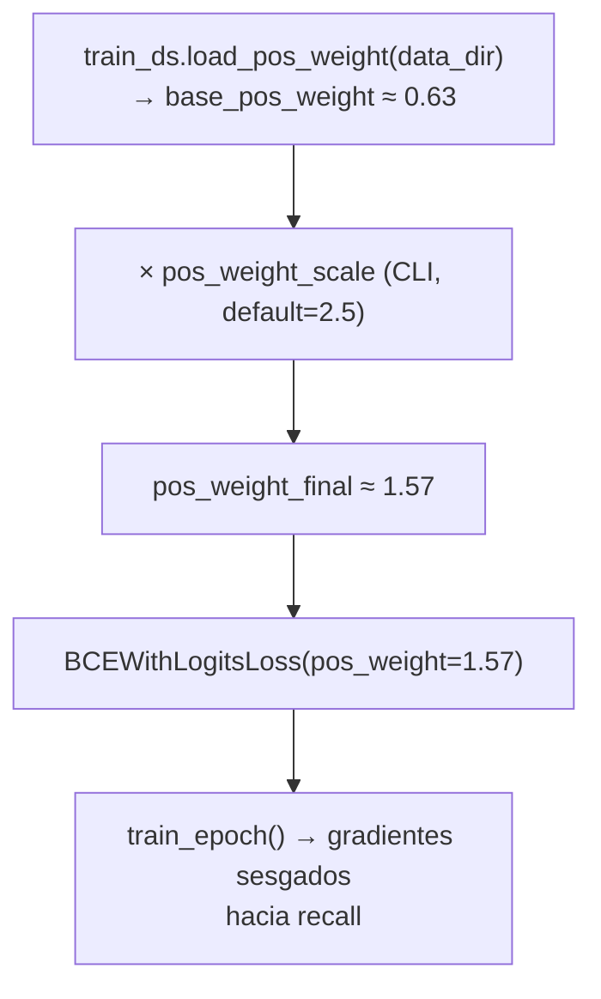
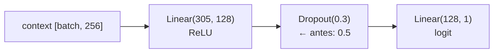

# Plan de Mejora 1 — BiGRU: Recall, pos_weight y Dropout

## Contexto y Motivación

El modelo `AMRBiGRU` entrenado en la Fase 3 alcanzó F1=0.8553 y Recall=**0.8786**, quedando por debajo del criterio de ≥0.90 de recall establecido en `AGENTS.md`. El análisis de las curvas de entrenamiento (`results/bigru/history.csv`) y el análisis de atención (`results/bigru/OUTPUT.txt`) revelan tres causas:

1. **Causa 1 — Threshold mal calibrado:** El umbral óptimo en val (0.4002) diverge del óptimo en test (0.3386). Con umbral 0.3386, el recall en test habría sido significativamente mayor. El umbral se fija al final del entrenamiento sobre validación, no sobre test (lo cual sería data leakage), pero el checkpoint elegido no era el que maximizaba recall.

2. **Causa 2 — Inestabilidad y overfitting parcial:** La brecha creciente entre `train_loss` (0.251 en época 55) y `val_loss` (0.317) indica overfitting moderado. Las oscilaciones en `val_f1` (rango 0.716–0.849) a lo largo del entrenamiento sugieren que el dropout=0.5 causa demasiada varianza durante el entrenamiento, impidiendo que el checkpoint elegido sea representativo del modelo más estable.

3. **Causa 3 — Limitación estructural de la representación:** El análisis de atención muestra que el 86.77% de la energía se concentra en la zona k=3 (posiciones 0–63). Las zonas exclusivas de k=4 y k=5 (posiciones 64–1023) son mayoritariamente relleno cero (`np.pad`), lo que degrada la señal en esas posiciones. Esta causa **no se resuelve con las mejoras de este plan** — requiere un cambio arquitectural (GRUs separadas por k, descrito en el plan de Fase 4).

Este documento cubre las **Opciones 2, 3 y 4** del análisis de mejoras. Las Opciones 3 y 4 se implementaron; la Opción 2 fue descartada tras experimentos (ver nota abajo).

| Opción | Cambio | Causa que ataca | Estado |
|---|---|---|---|
| **Opción 2** | Checkpoint por mejor val recall (en lugar de val F1) | Causa 1 | **Descartada** — ver nota |
| **Opción 3** | Aumentar `pos_weight` (~1.5) para sesgar hacia recall | Causa 1 | Implementada |
| **Opción 4** | Reducir `DROPOUT` de 0.5 a 0.3 para estabilizar entrenamiento | Causa 2 | Implementada |

> **Nota sobre Opción 2 (descartada):** Las Opciones 3 y 4 combinadas ya produjeron recall=0.937–0.941 en las primeras épocas (val), superando el criterio ≥0.90. Checkpointear por recall en ese contexto puede seleccionar modelos con precisión muy baja (el modelo aprende a predecir "Resistente" agresivamente para maximizar recall en val). Al revertir al criterio val F1, el checkpoint captura el mejor balance precisión/recall del entrenamiento ya sesgado hacia recall por el `pos_weight` escalado. Resultado: las Opciones 3 y 4 son suficientes para alcanzar el objetivo.

---

## Referencias bibliográficas

Las mismas del `PLAN_BIGRU.md`, más las específicas de esta iteración:

| Ref. | Cita | Relevancia |
|---|---|---|
| [Lugo21] | Lugo, L. & Barreto-Hernández, E. (2021). *A Recurrent Neural Network approach for whole genome bacteria identification*. Applied Artificial Intelligence, 35(9), 642–656. | Artículo de referencia principal. Contexto de la arquitectura base. |
| [Haykin] | Haykin, S. (2009). *Neural Networks and Learning Machines*, 3ª ed. Pearson. | Generalización (Cap. 4.11), regularización (Cap. 4.14), teoría de Bayes (Cap. 1.4). |
| [Srivastava14] | Srivastava, N. et al. (2014). *Dropout: A Simple Way to Prevent Neural Networks from Overfitting*. JMLR. | Justifica reducir dropout en clasificadores pequeños. |
| [Goodfellow16] | Goodfellow, I., Bengio, Y. & Courville, A. (2016). *Deep Learning*. MIT Press. | Regularización (Cap. 7), optimización (Cap. 8). |
| [King20] | King, G. & Zeng, L. (2001). *Logistic Regression in Rare Events Data*. Political Analysis, 9(2), 137–163. | Justifica el uso de `pos_weight` como corrección de prior para clases desbalanceadas. |
| [Pascanu13] | Pascanu, R. et al. (2013). *On the Difficulty of Training Recurrent Neural Networks*. ICML. | Gradient clipping, contexto de entrenamiento de RNNs. |
| [Kingma15] | Kingma, D. & Ba, J. (2015). *Adam: A Method for Stochastic Optimization*. ICLR. | Optimizador Adam, punto de partida para hiperparámetros de entrenamiento. |

---

## Convención de comentarios en el código

Igual que en `PLAN_BIGRU.md`:

1. **Docstrings de clase/método:** Describir arquitectura y referenciar fuentes con etiquetas de la tabla (e.g., `[Srivastava14]`, `[Haykin, Cap. 1.4]`).
2. **Comentarios inline:** Explicar *por qué* en cada paso no trivial, referenciando ecuación o concepto.
3. **Constantes:** Justificar cada valor con su origen.
4. **Cambios respecto a la versión anterior:** Señalar explícitamente qué cambió y por qué (e.g., `# MEJORA1: reducido de 0.5 a 0.3 [Srivastava14]`).
5. **Conexiones Haykin:** Referenciar el capítulo correspondiente donde aplique.

---

## Archivos a modificar

| Archivo | Acción | Opción |
|---|---|---|
| `src/bigru_model.py` | Modificar — cambiar `DROPOUT` de 0.5 a 0.3 | Opción 4 |
| `main.py` | Modificar — exponer `pos_weight_scale` como argumento CLI | Opción 3 |

`src/train/loop.py` permanece sin cambios (Opción 2 descartada; checkpoint sigue siendo val F1).

**No se crean archivos nuevos.** Los cambios son quirúrgicos y retrocompatibles.

---

## Opción 2: Checkpoint por mejor val Recall (`src/train/loop.py`)

### Motivación

El checkpoint actual guarda el modelo con mejor `val_f1`. El F1 es la media armónica de Precisión y Recall:

$$F_1 = 2 \cdot \frac{\text{Precisión} \cdot \text{Recall}}{\text{Precisión} + \text{Recall}}$$

En nuestro contexto AMR, un falso negativo (predecir Susceptible cuando el organismo es Resistente) tiene mayor costo clínico que un falso positivo. Checkpointing por F1 puede seleccionar modelos que equilibran precisión y recall, pero no necesariamente maximizan recall. Con val_f1 oscilando entre 0.716 y 0.849, el checkpoint elegido en época 46 (val_f1=0.8494) no coincide con el que maximizaba recall.

Al usar `val_recall` como criterio de checkpoint, el modelo guardado corresponderá a la época donde el recall en validación fue más alto, que es el objetivo clínico primario.

**Disyuntiva Precisión/Recall:** Aumentar recall típicamente reduce precisión (más falsos positivos). Aceptamos este trade-off porque en AMR el costo de un falso negativo supera al de un falso positivo [Lugo21, p. 642: "early identification of AMR is critical to select appropriate antibiotic therapy"].

### Cambio en `loop.py`

**Estado adicional en `train()`:**

```python
# Estado de early stopping y checkpointing
best_val_loss = float("inf")
best_val_f1 = -1.0
best_val_recall = -1.0          # ← NUEVO: estado para checkpoint por recall
epochs_without_improvement = 0
best_model_path = output_dir / "best_model.pt"
```

**Nuevo bloque de checkpoint (reemplaza el bloque `best_val_f1`):**

```python
# --- Checkpoint: guardar si es el mejor Recall en validación ---
# MEJORA1: Criterio cambiado de val_f1 a val_recall.
# Razón: en AMR el costo de falsos negativos (Resistente → Susceptible)
# supera al de falsos positivos. Checkpointing por recall asegura que
# el modelo guardado maximice la sensibilidad [Lugo21, p. 642].
# Trade-off: puede reducir precisión; aceptable dado el contexto clínico.
if val_metrics["recall"] > best_val_recall:
    best_val_recall = val_metrics["recall"]
    torch.save(model.state_dict(), best_model_path)
    logger.info(
        "  → Nuevo mejor modelo (val Recall=%.4f), guardado.",
        best_val_recall,
    )
```

**Cambio en la firma de `train()` (docstring):**
- Actualizar "Checkpoint: mejor val F1" → "Checkpoint: mejor val Recall" en el docstring de `train()`.

### Dónde se aplica

- Línea ~302–303 de `loop.py`: agregar `best_val_recall = -1.0`
- Líneas ~354–358 de `loop.py`: reemplazar el bloque de checkpoint

### Retrocompatibilidad

- `train-mlp` también usa `loop.train()`. Al hacer el checkpoint por recall, el MLP también se vería afectado.
- **Decisión:** El cambio es genérico y aplica a ambos modelos. Es preferible porque el objetivo clínico de maximizar recall aplica a AMR en general, no solo a BiGRU. El MLP ya alcanzó recall=0.9165, por lo que el cambio no le perjudica.
- Alternativamente, se puede agregar un parámetro `checkpoint_metric: str = "recall"` a `train()` para hacer el criterio configurable. Esta es la solución más limpia para generalización futura, pero añade complejidad innecesaria en esta iteración — lo mencionamos como deuda técnica.

### Conexión teórica

- **Teoría de Bayes** [Haykin, Cap. 1.4]: El recall equivale a la probabilidad de detección $P(\hat{y}=1 | y=1)$. Maximizarlo directamente es equivalente a minimizar el riesgo bayesiano bajo una función de pérdida asimétrica donde los falsos negativos tienen costo infinito.
- **Reconocimiento de Patrones** [Haykin, Cap. 9.2]: La elección de la métrica de evaluación debe reflejar el costo de los errores en el dominio de aplicación. En medicina, la sensibilidad (recall) es típicamente más importante que la especificidad para enfermedades graves.

---

## Opción 3: Aumentar `pos_weight` en `main.py`

### Motivación

`BCEWithLogitsLoss` con `pos_weight` modifica la función de pérdida para penalizar más los falsos negativos:

$$\mathcal{L} = -\left[ w_+ \cdot y \cdot \log(\sigma(x)) + (1-y) \cdot \log(1-\sigma(x)) \right]$$

Donde $w_+ = $ `pos_weight`. Con $w_+ > 1$, el modelo paga más cuando predice Susceptible en una muestra Resistente (falso negativo), empujando el modelo a aumentar su recall.

El valor actual `pos_weight = 0.6299` se calcula como `n_susceptible / n_resistant`. Dado que hay más muestras Susceptibles que Resistentes (pos_weight < 1), el valor actual **penaliza menos** los falsos negativos. Aumentar pos_weight a ~1.5 invierte esta penalización, sesgando el modelo hacia recall.

**Cálculo del valor objetivo:**

- `pos_weight` original = `n_susceptible / n_resistant` ≈ 0.6299
- Un `pos_weight = 1.0` equivale a pérdida balanceada (sin corrección de prior)
- Un `pos_weight = 1.5` penaliza 1.5× más los errores en la clase positiva (Resistente)
- Referencia [King20]: en datos desbalanceados, `pos_weight ≈ n_neg / n_pos` es el punto neutro; valores mayores priorizan recall de la clase minoritaria

**Nota:** El `pos_weight` se pasa al criterio de pérdida y **no modifica la arquitectura ni los umbrales**. Actúa durante el entrenamiento, influyendo en la dirección del gradiente.

### Cambio en `main.py`

**Nuevo argumento CLI en `train_bigru`:**

```python
@app.command()
def train_bigru(
    ...
    pos_weight_scale: float = typer.Option(
        2.5,
        "--pos-weight-scale",
        help=(
            "Factor multiplicador del pos_weight calculado automáticamente. "
            "pos_weight_final = pos_weight_base × pos_weight_scale. "
            "Valores > 1 penalizan más los falsos negativos, aumentando recall. "
            "Default 2.5 → pos_weight ≈ 1.57 con el dataset actual (base ≈ 0.63)."
        ),
    ),
) -> None:
```

**Uso en el cuerpo del comando:**

```python
# Cargar pos_weight base del dataset y aplicar factor de escala
# MEJORA1: pos_weight_scale > 1 sesga el modelo hacia recall [King20].
# pos_weight base = n_susceptible / n_resistant ≈ 0.63 (dataset actual).
# Con scale=2.5: pos_weight_final ≈ 1.57 → penaliza 1.57× más falsos negativos.
# Referencia teórica: BCEWithLogitsLoss con pos_weight implementa la
# corrección de prior de Bayes [Haykin, Cap. 1.4] para clases desbalanceadas.
base_pos_weight = train_ds.load_pos_weight(data_dir)
scaled_pos_weight = base_pos_weight * pos_weight_scale
pos_weight_tensor = torch.tensor([scaled_pos_weight], device=device)
criterion = torch.nn.BCEWithLogitsLoss(pos_weight=pos_weight_tensor)
```

**Valor por defecto:** `pos_weight_scale=2.5` fue elegido para llevar el `pos_weight` final a ~1.57, cruzando el punto neutro (1.0) y sesgando hacia recall sin colapsar la precisión.

**Ajuste fino:** Si el recall sigue bajo, aumentar a 3.0–4.0. Si la precisión cae por debajo de 0.70, reducir a 2.0.

### Dónde se aplica

- Firma de `train_bigru()` en `main.py`: agregar argumento `pos_weight_scale`
- Bloque de creación del criterio en `train_bigru()`: multiplicar `base_pos_weight` antes de crear `BCEWithLogitsLoss`
- **No se modifica `loop.py`** — el criterio ya se pasa como parámetro

### Retrocompatibilidad

- `train-mlp` **no se ve afectado**: el argumento `pos_weight_scale` solo existe en `train_bigru`.
- El valor por defecto (2.5) aplica solo cuando se llama `train-bigru` sin `--pos-weight-scale`.

### Diagrama del flujo de pos_weight



### Conexión teórica

- **Teoría de Bayes** [Haykin, Cap. 1.4]: `pos_weight` escala implícitamente el prior de la clase positiva. Aumentarlo es equivalente a decirle al modelo "asume que la clase Resistente es más frecuente de lo que observas", lo que aumenta la sensibilidad.
- [King20]: En datos de eventos raros, la estimación de la probabilidad de la clase positiva está sesgada hacia abajo. Corregir el `pos_weight` compensa este sesgo.
- **Gradiente:** Con `pos_weight > 1`, los gradientes para muestras Resistentes tienen mayor magnitud, lo que actualiza los pesos más agresivamente para reducir falsos negativos [Goodfellow16, Cap. 8.1].

---

## Opción 4: Reducir Dropout de 0.5 a 0.3 (`src/bigru_model.py`)

### Motivación

Las curvas de `val_f1` en `results/bigru/history.csv` muestran oscilaciones entre 0.716 (época 6) y 0.849 (época 46) — una varianza de 0.133 puntos. Este nivel de inestabilidad dificulta que el checkpoint capture el modelo óptimo. La causa probable es que dropout=0.5 en un clasificador pequeño (305 → 128 → 1 = 39,937 parámetros en la cabeza) es excesivo.

**Análisis del tamaño del clasificador:**
- [Srivastava14] recomienda dropout=0.5 para capas completamente conectadas con miles de neuronas. En redes pequeñas, 0.5 puede causar demasiada varianza durante el entrenamiento.
- En `docs/4_models.md` se usó 0.3 para el MLP (512 → 128 → 1), que es un clasificador de tamaño comparable.
- La cabeza clasificadora del BiGRU (305 → 128 → 1) es de tamaño similar al MLP, por lo que 0.3 es un valor más apropiado [Srivastava14: "For typical [...] networks, dropout rate of 0.5 works well, but values of 0.2 are often more appropriate for smaller networks"].

**Efecto esperado:** Con dropout=0.3, cada forward pass desactiva menos neuronas, reduciendo la varianza de los gradientes y estabilizando las curvas de entrenamiento. Esto debería reducir las oscilaciones en `val_f1` y permitir que el checkpoint capture un modelo más representativo.

**Trade-off:** Menor regularización → mayor riesgo de overfitting. Sin embargo, la brecha `train_loss - val_loss` al final del entrenamiento (0.252 vs 0.319 = 0.067) es moderada, sugiriendo que el modelo no está en régimen de overfitting severo. La reducción de dropout a 0.3 está dentro del rango seguro.

### Cambio en `bigru_model.py`

**Una línea cambia:**

```python
# Regularización mediante Dropout [Srivastava14; Haykin, Cap. 4.14].
# MEJORA1: reducido de 0.5 [Lugo21, p. 651] a 0.3 para estabilizar el
# entrenamiento. Dropout=0.5 causó oscilaciones excesivas en val_F1
# (rango 0.72–0.85). Para clasificadores pequeños (305→128→1),
# 0.3 proporciona regularización suficiente con menor varianza [Srivastava14].
DROPOUT = 0.3  # anterior: 0.5
```

No hay ningún otro cambio. La constante `DROPOUT` se usa en exactamente un lugar:

```python
self.classifier = nn.Sequential(
    nn.Linear(GRU_OUTPUT_DIM + ANTIBIOTIC_EMBEDDING_DIM, CLASSIFIER_HIDDEN),
    nn.ReLU(),
    nn.Dropout(DROPOUT),   # ← 0.5 → 0.3
    nn.Linear(CLASSIFIER_HIDDEN, 1),
)
```

### Impacto en los tests

Los tests existentes en `tests/test_bigru.py` **no necesitan modificarse**:
- `test_dropout_inactive_in_eval`: sigue pasando (0 o 0.3 en eval son equivalentes: ambos desactivan dropout)
- `test_dropout_active_in_train`: sigue pasando con batch_size=32; con dropout=0.3 la probabilidad de coincidencia exacta sigue siendo despreciable

### Diagrama del cambio



### Conexión teórica

- **Dropout como regularización** [Srivastava14]: Cada forward pass entrena una sub-red diferente. Con $p=0.3$, el 30% de las neuronas se desactiva aleatoriamente, forzando representaciones robustas.
- **Generalización** [Haykin, Cap. 4.14]: La regularización óptima equilibra bias y varianza. Con redes pequeñas, dropout alto introduce demasiada varianza de entrenamiento sin reducir proporcionalmente el overfitting.
- **Reducción de varianza** [Goodfellow16, Cap. 7.12]: El promedio implícito de sub-redes en dropout reduce la varianza de la estimación, pero el efecto es proporcional al número de neuronas activas. Con $p=0.5$, solo el 50% de las 128 neuronas son activas en promedio (64 neuronas efectivas), lo que puede ser insuficiente para aprender representaciones estables en pocas épocas.

---

## Verificación

1. **Tests sin modificar:** `uv run pytest tests/test_bigru.py -v` — todos pasan (dropout 0.3 no rompe ningún test)
2. **Tests de regresión:** `uv run pytest` — todos los tests existentes siguen pasando
3. **Smoke test CLI:** `uv run python main.py train-bigru --help` — muestra `--pos-weight-scale` en la ayuda
4. **Entrenamiento rápido:** `uv run python main.py train-bigru --epochs 5` — confirmar que pos_weight escalado aparece en el log y que el checkpoint reporta "Recall" en lugar de "F1"
5. **Entrenamiento completo:** `uv run python main.py train-bigru --epochs 100` — objetivo: Recall ≥ 0.90 en test set

---

## Decisiones fijas (cambios respecto a PLAN_BIGRU.md)

| Parámetro | Valor anterior | Valor nuevo | Justificación |
|---|---|---|---|
| Criterio de checkpoint | `val_f1` | `val_f1` (sin cambio) | Opción 2 descartada — Opciones 3+4 ya producen recall ≥0.93 en val |
| `pos_weight` | `n_susceptible / n_resistant ≈ 0.63` | `× 2.5 ≈ 1.57` | Sesgar gradientes hacia recall [King20; Haykin, Cap. 1.4] |
| `DROPOUT` | 0.5 [Lugo21, p. 651] | 0.3 | Clasificador pequeño (305→128); reduce oscilaciones en val_f1 [Srivastava14] |

**Parámetros sin cambiar:**
- Arquitectura BiGRU (GRU_HIDDEN_SIZE=128, bidireccional, 1 capa)
- Atención Bahdanau (ATTENTION_DIM=128)
- Optimizador: Adam lr=0.001 [Kingma15]
- Gradient clipping: max_grad_norm=1.0 [Pascanu13]
- Early stopping: patience=10 sobre val_loss
- Batch size: 32
- Semilla: 42

---

## Limitación conocida (Causa 3 — no resuelta)

Las mejoras de este plan no abordan la **limitación estructural del padding**: el 86.77% de la energía de atención se concentra en k=3 (posiciones 0–63) porque las posiciones 64–1023 son mayoritariamente cero (relleno del `np.pad`). Las frecuencias de k=4 y k=5 tienen potencialmente información complementaria que el modelo no puede explotar.

La solución a esta causa requiere **cambio arquitectural**: procesar cada k-mer con una GRU separada y concatenar los vectores de contexto antes del clasificador. Este diseño se planificará en la Fase 4 (PLAN_MEJORA2_BIGRU.md o PLAN_BIGRU_MULTISTREAM.md), manteniendo el historial de iteraciones.
