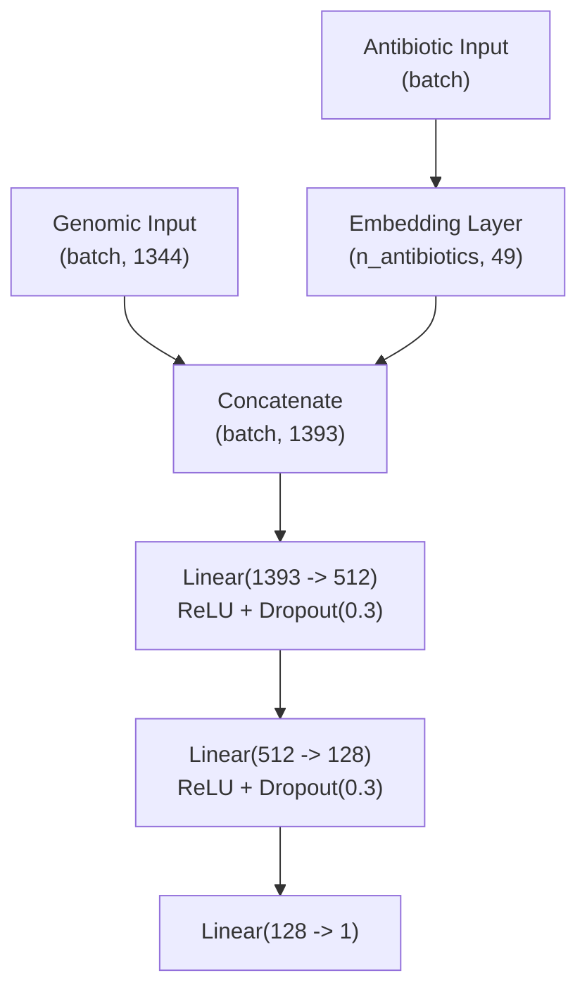

# Plan de Implementación — MLP y Entrenamiento

## Archivos a crear/modificar

| Archivo | Acción |
|---|---|
| `src/dataset.py` | Nuevo — `AMRDataset` |
| `src/mlp_model.py` | Implementar `AMRMLP` |
| `src/train/` | Paquete: loop de entrenamiento, métricas, early stopping |
| `main.py` | Agregar comando `train-mlp` |
| `tests/test_train.py` | Tests unitarios de entrenamiento |

---

## 1. Dataset (`src/dataset.py`)

Clase `AMRDataset(torch.utils.data.Dataset)`:

- **Constructor:** recibe `data_dir` (directorio de outputs del pipeline) y `split` (`"train"`, `"val"`, `"test"`)
- **Pre-carga en `__init__`:** carga todos los `.npy` de `mlp/` en memoria como tensores `torch.float32` (86 MB aprox. para 16k genomas — cabe en RAM y elimina I/O de disco durante el entrenamiento)
- **`__getitem__`:** devuelve `(genome_vector, antibiotic_idx, label)` como tensores CPU — el device placement lo hace el training loop
- **Fuentes de datos:**
  - `splits.csv` — filtrar por split
  - `cleaned_labels.csv` — triples `(genome_id, antibiotic, label)`
  - `antibiotic_index.csv` — mapeo antibiótico → entero
  - `mlp/<genome_id>.npy` — vector 1344-dim ya normalizado

**Conexión con Haykin:** Implementa la **Representación del Conocimiento (Cap. 7)** al organizar las "observaciones del mundo" (vectores genómicos) y el "conocimiento etiquetado" (fenotipos) para permitir un **Aprendizaje Supervisado (Cap. 8)** mediante el paradigma de aprendizaje con un maestro.

---

## 2. Modelo (`src/mlp_model.py`)

Clase `AMRMLP(nn.Module)`:

- `n_antibiotics` se recibe como parámetro — **no hardcodeado a 96** (el filtro Broth dilution cambia el conteo real)
- `TOTAL_KMER_DIM = 1344` importado de `data_pipeline.constants`
- Factory method `AMRMLP.from_antibiotic_index(path)` que lee el CSV y construye el modelo con el conteo correcto
- La capa de salida retorna logits — `BCEWithLogitsLoss` incorpora la sigmoid internamente

**Conexión con Haykin:** Se define como un **Perceptrón Multicapa (Cap. 4)** que utiliza capas ocultas para extraer estadísticas de orden superior de los datos de entrada. El uso de ReLU aporta la **No Linealidad (Cap. 4.1)** necesaria para aproximar funciones complejas, mientras que el Dropout actúa como una forma de **Regularización de la Complejidad (Cap. 4.14)** para mejorar la **Generalización (Cap. 4.11)**.

---

## 3. Entrenamiento (`src/train/`)

Paquete con lógica de aprendizaje y métricas.

### `loop.py`: `set_seed(seed: int)`
Configura semillas en `random`, `numpy`, `torch`, `torch.cuda` y `torch.backends.cudnn.deterministic = True` para reproducibilidad completa.

### `loop.py`: `train_epoch(model, loader, optimizer, criterion, device)`
Una pasada por el train set. Devuelve loss promedio.

### `evaluate.py`: `evaluate(model, loader, criterion, device, threshold=0.5)`
Devuelve: loss, accuracy, precision, recall, F1, AUC-ROC.
Calcula también el threshold óptimo (máximo F1) sobre el conjunto dado — útil en val para no asumir 0.5 con clases desbalanceadas.

### `loop.py`: `train(model, train_loader, val_loader, ...)`
- Adam, lr=0.001, max 100 epochs
- `BCEWithLogitsLoss(pos_weight=...)` — el `pos_weight` se lee de `data/processed/train_stats.json` generado por el pipeline (no hardcodeado)
- Early stopping y checkpoint: ambos sobre **val_F1** (patience configurable)
- ReduceLROnPlateau sobre **val_F1**
- Log por epoch: loss train/val, accuracy, precision, recall, F1, AUC-ROC
- Detección automática de device: CUDA → MPS → CPU

### Outputs en `results/mlp/`
- `best_model.pt` — checkpoint con mejor val F1
- `metrics.json` — métricas finales sobre test set
- `history.csv` — métricas por epoch (para graficar)
- `history.png` — curvas de loss y F1 vs epochs, generadas al terminar

**Conexión con Haykin:** El proceso de entrenamiento es una aplicación del **Algoritmo de Retropropagación (Cap. 4.4)**. El uso de **Validación Cruzada (Cap. 4.13)** y el método de **Parada Temprana / Early Stopping (Cap. 4.13, Fig. 4.17)** garantizan que la red no caiga en el *overfitting* (memorización). El ajuste dinámico de `pos_weight` se fundamenta en la teoría del **Clasificador de Bayes (Cap. 1.4)** para minimizar el riesgo promedio bajo distribuciones de clase no uniformes.

---

## 4. CLI (`main.py`)

Comando `train-mlp`:
- `--data-dir` (default: `data/processed`)
- `--output-dir` (default: `results/mlp`)
- `--epochs` (default: 100)
- `--batch-size` (default: 32)
- `--lr` (default: 0.001)
- `--patience` (default: 10)

---

## 5. Tests (`tests/test_mlp.py`)

- **Shape de salida:** `[batch, 1]` con batch de tamaño arbitrario
- **Logits sin acotar:** verificar que la salida no está restringida a `[0, 1]` (sigmoid accidental)
- **Modo eval vs train:** Dropout inactivo en `model.eval()`
- **`from_antibiotic_index`:** instancia correctamente leyendo el CSV

**Conexión con Haykin:** Verificar que el modelo retorna logits asegura la **Diferenciabilidad (Cap. 4.1)** de la función de red, requisito indispensable para que el algoritmo de retropropagación pueda calcular los gradientes localmente a través de la regla de la cadena.

---

## Decisiones fijas

| Parámetro | Valor | Origen | Justificación Haykin |
|---|---|---|---|
| Input genómico | 1344 dims | `TOTAL_KMER_DIM` en constants | **Representación (Cap. 7)**: Histogramas de k-meros como vectores de características. |
| Embedding antibiótico | 49 dims | `min(50, (96//2)+1)` — EDA | **Invarianza (Cap. 7.1)**: Mapeo de categorías a un espacio de características continuo. |
| Capas ocultas | 512 → 128 | docs/4_models.md | **Arquitectura (Cap. 4.2)**: Capas para extracción jerárquica de información. |
| Dropout | 0.3 | docs/4_models.md | **Regularización (Cap. 4.14)**: Control de la complejidad para evitar el sobreentrenamiento. |
| Optimizador | Adam lr=0.001 | docs/5_experiments.md | **Optimización (Cap. 4.16)**: Variante eficiente de la búsqueda en la superficie de error. |
| Batch size | 32 | docs/5_experiments.md | **Aprendizaje por Lotes (Cap. 4.3)**: Balance entre estimación de gradiente y velocidad. |
| Loss | `BCEWithLogitsLoss` + pos_weight dinámico | AGENTS.md | **Teoría de Bayes (Cap. 1.4)**: Minimización del riesgo promedio ante desbalance. |
| Early stopping | patience configurable, sobre val_F1 | AGENTS.md | **Generalización (Cap. 4.11)**: Evitar la fase de memorización del ruido. |
| Mejor modelo | mayor val F1 | AGENTS.md | **Reconocimiento de Patrones (Cap. 9)**: Maximizar la utilidad estadística del clasificador. |
| Semilla | 42 | AGENTS.md | **Trayectoria de Pesos (Cap. 4.4)**: Garantizar consistencia en la convergencia. |
