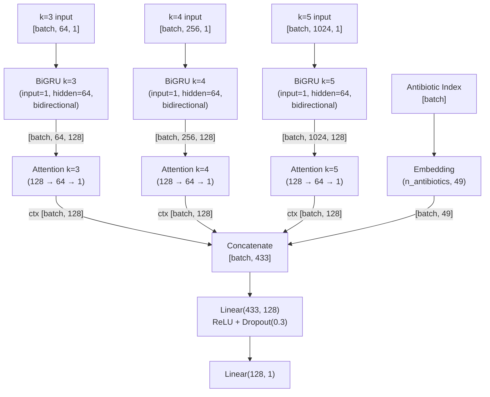

# Plan de Implementación — Multi-Stream BiGRU (AMRMultiBiGRU)

> **Nota histórica:** Este plan describe el diseño original (BiGRU separada por stream). La implementación final fue refactorizada a un encoder **order-independent** (`KmerStream` = LayerNorm sin affine + proyección element-wise + `bin_importance` + attention pooling), sin dependencias secuenciales entre bins. Los archivos de código mencionados en este plan (`src/multi_bigru_model.py`, `src/dataset.py`) no existen; la implementación actual está en `src/models/multi_bigru/`. Resultados finales: F1=0.8514, Recall=0.8925, AUC=0.8944.

## Contexto y Motivación

Los modelos anteriores (BiGRU v1 y v2) procesan la entrada genómica como una matriz `[1024, 3]` donde cada columna es un histograma de k-meros paddeado con ceros hasta 1024 posiciones. Este padding introduce un problema estructural confirmado por el análisis de atención:

```
Posición    Col 0 (k=3)    Col 1 (k=4)    Col 2 (k=5)    Atención
───────────────────────────────────────────────────────────────────
0-63        DATOS          DATOS          DATOS          86.77%
64-255      CEROS          DATOS          DATOS          12.92%
256-1023    CEROS          CEROS          DATOS           0.31%
```

El mecanismo de atención aprende a ignorar las posiciones con ceros, concentrando el 86.77% de su energía en las primeras 64 posiciones. Las frecuencias exclusivas de k=4 (posiciones 64–255) y k=5 (posiciones 256–1023) son desaprovechadas. Esto explica por qué el MLP (que concatena los histogramas sin padding y los trata todos igualmente) es competitivo con la BiGRU en F1.

**La solución:** procesar cada histograma de k-meros con una GRU separada, sin padding. Cada GRU recibe la secuencia completa de su k (64, 256, o 1024 timesteps), produce su propio vector de contexto vía atención, y los tres vectores se concatenan antes del clasificador.

### Resultados actuales

| Modelo | F1 | Recall | AUC-ROC | Precision | Params |
|---|---|---|---|---|---|
| MLP | 0.8600 | 0.9165 | 0.9035 | 0.8100 | ~710K |
| BiGRU v1 (dropout=0.5, pw=0.63) | 0.8553 | 0.8786 | 0.9009 | 0.8332 | 177K |
| BiGRU v2 (dropout=0.3, pw=1.57) | 0.8566 | 0.9032 | 0.8998 | 0.8146 | 177K |

Objetivo: superar el MLP en F1 manteniendo Recall ≥ 0.90.

---

## Referencias bibliográficas

| Ref. | Cita | Relevancia |
|---|---|---|
| [Lugo21] | Lugo, L. & Barreto-Hernández, E. (2021). *A Recurrent Neural Network approach for whole genome bacteria identification*. Applied Artificial Intelligence, 35(9), 642–656. | Arquitectura base. La representación distribuida de k-meros (p. 647) es la que motivó el padding original. |
| [Haykin] | Haykin, S. (2009). *Neural Networks and Learning Machines*, 3ª ed. Pearson. | RNNs (Cap. 15), generalización (Cap. 4.11), regularización (Cap. 4.14). |
| [Cho14] | Cho, K. et al. (2014). *Learning Phrase Representations using RNN Encoder-Decoder*. EMNLP. | Unidad GRU: compuertas de actualización y reinicio. |
| [Bahdanau15] | Bahdanau, D., Cho, K. & Bengio, Y. (2015). *Neural Machine Translation by Jointly Learning to Align and Translate*. ICLR. | Mecanismo de atención aditiva. |
| [Schuster97] | Schuster, M. & Paliwal, K. (1997). *Bidirectional Recurrent Neural Networks*. IEEE Trans. Signal Processing. | Bidireccionalidad en RNNs. |
| [Goodfellow16] | Goodfellow, I., Bengio, Y. & Courville, A. (2016). *Deep Learning*. MIT Press. | Regularización (Cap. 7), optimización (Cap. 8), fusión multimodal (Cap. 15). |
| [Pascanu13] | Pascanu, R. et al. (2013). *On the Difficulty of Training Recurrent Neural Networks*. ICML. | Gradient clipping para RNNs. |
| [Srivastava14] | Srivastava, N. et al. (2014). *Dropout: A Simple Way to Prevent Neural Networks from Overfitting*. JMLR. | Dropout como regularización. |
| [Kingma15] | Kingma, D. & Ba, J. (2015). *Adam: A Method for Stochastic Optimization*. ICLR. | Optimizador Adam. |
| [Graves12] | Graves, A. (2012). *Supervised Sequence Labelling with Recurrent Neural Networks*. Ph.D. thesis. | Sequence labeling con RNNs. |
| [Ngiam11] | Ngiam, J. et al. (2011). *Multimodal Deep Learning*. ICML. | Fusión de representaciones de diferentes modalidades antes de la clasificación. |

---

## Convención de comentarios en el código

Igual que en `PLAN_BIGRU.md`:

1. **Docstrings de clase/método:** Describir arquitectura y referenciar fuentes con etiquetas (e.g., `[Bahdanau15]`, `[Haykin, Cap. 15]`).
2. **Comentarios inline:** Explicar *por qué* en cada paso no trivial, referenciando ecuación o concepto.
3. **Constantes:** Justificar cada valor con su origen.
4. **Conexiones Haykin:** Referenciar el capítulo correspondiente donde aplique.

---

## Archivos a crear/modificar

| Archivo | Acción |
|---|---|
| `src/multi_bigru_model.py` | **Nuevo** — `AMRMultiBiGRU` con GRUs separadas por k |
| `src/dataset.py` | **Modificar** — agregar `model_type="multi_bigru"` |
| `src/data_pipeline/constants.py` | **Modificar** — agregar constantes del nuevo modelo |
| `main.py` | **Modificar** — agregar comando `train-multi-bigru` |
| `tests/test_multi_bigru.py` | **Nuevo** — tests unitarios del modelo |
| `tests/test_dataset.py` | **Modificar** — test de carga con `model_type="multi_bigru"` |

---

## 1. Representación de datos

### Problema del formato actual

El formato `bigru` (`[1024, 3]`) fuerza a las tres secuencias a compartir la misma dimensión temporal. Los histogramas k=3 (64 dims) y k=4 (256 dims) se rellenan con 960 y 768 ceros respectivamente. Estos ceros no contienen información biológica y diluyen la señal.

### Nuevo formato: `multi_bigru`

En lugar de una sola matriz, el dataset retorna **tres tensores separados**, uno por k:

```
k=3: tensor de shape (64,)    — sin padding
k=4: tensor de shape (256,)   — sin padding
k=5: tensor de shape (1024,)  — sin padding (nunca tuvo padding)
```

Cada tensor es una secuencia 1D que la GRU correspondiente procesará como `[batch, seq_len, 1]` (una sola feature por timestep).

### Almacenamiento en disco

**No se crean archivos nuevos.** El formato `multi_bigru` reutiliza los vectores MLP existentes (`data/processed/mlp/*.npy`, shape `(1344,)`) y los divide en tiempo de carga:

```python
# En dataset.py, dentro de __getitem__:
# El vector MLP de 1344 dims se segmenta en sus histogramas originales.
# KMER_DIMS = [64, 256, 1024] — tamaños naturales sin padding.
vec = numpy.load(path)  # (1344,)
k3 = vec[0:64]          # (64,)
k4 = vec[64:320]        # (256,)
k5 = vec[320:1344]      # (1024,)
```

Esto es eficiente: no duplica datos en disco, y el slicing es O(1) en numpy. El overhead es mínimo comparado con cargar desde archivos separados.

### Constantes nuevas en `constants.py`

```python
# Offsets acumulados para segmentar el vector MLP en histogramas individuales.
# Cada histograma tiene 4^k dimensiones [Lugo21, p. 647].
KMER_OFFSETS = [0, 64, 320, 1344]  # [0, sum(KMER_DIMS[:1]), sum(KMER_DIMS[:2]), sum(KMER_DIMS[:3])]
```

### Conexión teórica

- [Lugo21, p. 647]: "Our set of k's generates a concatenated vector of only 1344 positions." El formato MLP ya contiene las tres secuencias concatenadas — solo las separamos en lugar de paddearlas.
- [Ngiam11]: La fusión de representaciones de diferentes "modalidades" (aquí, diferentes resoluciones de k-meros) es más efectiva cuando cada modalidad se procesa por separado antes de la fusión.
- [Haykin, Cap. 7]: **Representación del Conocimiento** — la misma información biológica se codifica de forma más eficiente al respetar la dimensionalidad natural de cada k.

---

## 2. Dataset (`src/dataset.py` — modificación)

### Cambio en `__init__`

Agregar `"multi_bigru"` a la validación de `model_type`:

```python
if model_type not in ("mlp", "bigru", "multi_bigru"):
    raise ValueError(f"model_type debe ser 'mlp', 'bigru' o 'multi_bigru', recibido: '{model_type}'")
```

Para `model_type="multi_bigru"`, cargar los vectores desde `data_dir / "mlp"` (reutiliza los `.npy` del MLP):

```python
# multi_bigru reutiliza los vectores MLP y los segmenta en __getitem__
vectors_dir = data_dir / ("mlp" if model_type == "multi_bigru" else model_type)
```

### Cambio en `__getitem__`

Para `model_type="multi_bigru"`, retornar una tupla de 3 tensores en lugar de un solo tensor:

```python
def __getitem__(self, idx):
    genome_tensor, ab_idx, label = ...  # carga actual

    if self._model_type == "multi_bigru":
        # Segmentar el vector MLP (1344,) en histogramas individuales [Lugo21, p. 647].
        # Cada k-mero se procesa por una GRU separada, evitando el padding
        # que causaba la concentración de atención en k=3 (Causa 3, PLAN_MEJORA1).
        k3 = genome_tensor[0:64].unsqueeze(1)       # (64, 1)
        k4 = genome_tensor[64:320].unsqueeze(1)      # (256, 1)
        k5 = genome_tensor[320:1344].unsqueeze(1)    # (1024, 1)
        return (k3, k4, k5), ab_idx, label

    return genome_tensor, ab_idx, label
```

El `unsqueeze(1)` agrega la dimensión de features para que cada GRU reciba `[batch, seq_len, 1]`.

### Nota sobre el collate

El `DataLoader` de PyTorch soporta tuplas anidadas de forma nativa. Si `__getitem__` retorna `((k3, k4, k5), ab_idx, label)`, el DataLoader producirá batches con `((k3_batch, k4_batch, k5_batch), ab_idx_batch, label_batch)` automáticamente — no se necesita un `collate_fn` personalizado.

---

## 3. Modelo (`src/multi_bigru_model.py`)

### Arquitectura General



### Justificación del diseño

1. **GRUs separadas por k:** Cada histograma tiene longitud y semántica diferente. k=3 captura patrones muy locales (codones), k=5 captura patrones más largos. Procesar cada uno con su propia GRU permite que la atención opere sobre secuencias sin ceros, asignando pesos basados en información real.

2. **GRU hidden_size=64 (vs 128 en BiGRU v1):** Con tres GRUs, el número de parámetros se multiplica. Reducir el hidden_size de 128 a 64 mantiene el conteo total de parámetros comparable al BiGRU v1 (~177K). Cada GRU produce un output de 128 dims (64×2 bidireccional), y tres contextos concatenados dan 384 dims — comparable a los 256 del BiGRU v1.

3. **Atención independiente por k:** Cada GRU tiene su propio módulo de atención. Esto permite inspeccionar qué posiciones dentro de cada k son importantes, sin la contaminación cruzada del modelo anterior.

4. **Fusión tardía:** Los tres vectores de contexto se concatenan con el embedding de antibiótico antes del clasificador. Esto sigue el principio de fusión tardía [Ngiam11]: dejar que cada modalidad aprenda su representación antes de combinarlas.

### 3.1 Constantes del módulo

```python
# Hiperparámetros del Multi-Stream BiGRU
# GRU hidden_size reducido de 128 a 64 para compensar el triplicado de GRUs,
# manteniendo el conteo total de parámetros comparable al BiGRU v1 (~177K).
STREAM_GRU_HIDDEN = 64               # hidden size por GRU individual
STREAM_GRU_OUTPUT = STREAM_GRU_HIDDEN * 2  # 128 — forward + backward [Schuster97]
NUM_STREAMS = 3                       # una GRU por k ∈ {3, 4, 5}

# Atención [Bahdanau15]
STREAM_ATTENTION_DIM = 64             # dimensión interna del espacio de atención por stream

# Clasificador
# Entrada: 3 contextos × 128 dims + 49 embedding = 433
CLASSIFIER_INPUT = NUM_STREAMS * STREAM_GRU_OUTPUT + ANTIBIOTIC_EMBEDDING_DIM  # 433
CLASSIFIER_HIDDEN = 128               # capa densa tras concatenación

# Regularización [Srivastava14; MEJORA1]
DROPOUT = 0.3
```

### 3.2 Reutilización de `BahdanauAttention`

La clase `BahdanauAttention` de `bigru_model.py` es reutilizable directamente — solo cambian los argumentos de instanciación (`hidden_dim=128` en lugar de `256`, `attention_dim=64` en lugar de `128`). Se importa desde `bigru_model`:

```python
from bigru_model import BahdanauAttention
```

### 3.3 `KmerStream(nn.Module)`

Encapsula una GRU + Atención para un solo k-mero. Evita duplicar código para cada stream.

```python
class KmerStream(nn.Module):
    """
    Stream individual: BiGRU + Atención para un histograma de k-meros.

    Cada stream procesa una secuencia de longitud variable (64, 256, o 1024)
    sin padding, permitiendo que la atención se enfoque en información real
    en lugar de ceros [Haykin, Cap. 15].
    """

    def __init__(self, seq_len: int) -> None:
        super().__init__()
        self.gru = nn.GRU(
            input_size=1,                    # 1 feature por timestep (frecuencia normalizada)
            hidden_size=STREAM_GRU_HIDDEN,   # 64
            num_layers=1,
            batch_first=True,
            bidirectional=True,
        )
        self.attention = BahdanauAttention(
            hidden_dim=STREAM_GRU_OUTPUT,    # 128
            attention_dim=STREAM_ATTENTION_DIM,  # 64
        )
        self._seq_len = seq_len              # para documentación/debug

    def forward(self, x: torch.Tensor) -> tuple[torch.Tensor, torch.Tensor]:
        """
        Procesa un histograma de k-meros.

        Parámetros:
            x: [batch, seq_len, 1]

        Retorna:
            (context, attention_weights)
            context: [batch, 128]
            attention_weights: [batch, seq_len]
        """
        # BiGRU [Cho14; Schuster97]
        gru_out, _ = self.gru(x)      # [batch, seq_len, 128]
        # Atención aditiva [Bahdanau15]
        context, alpha = self.attention(gru_out)
        return context, alpha
```

### 3.4 `AMRMultiBiGRU(nn.Module)`

```python
class AMRMultiBiGRU(nn.Module):
    """
    Arquitectura Multi-Stream BiGRU + Atención para predicción de AMR.

    A diferencia de AMRBiGRU que procesa una matriz [1024, 3] con padding,
    este modelo procesa cada histograma de k-meros (k=3,4,5) con una BiGRU
    separada. Esto elimina el padding y permite que cada mecanismo de atención
    opere sobre información real [Haykin, Cap. 15; Ngiam11].

    Arquitectura:
        k=3 [batch,64,1]  → BiGRU(64) → Attention → ctx [batch,128]
        k=4 [batch,256,1] → BiGRU(64) → Attention → ctx [batch,128]   → Concat(433) → MLP → logit
        k=5 [batch,1024,1]→ BiGRU(64) → Attention → ctx [batch,128]
        antibiotic_idx    → Embedding(49)          → emb [batch,49]
    """

    def __init__(self, n_antibiotics: int) -> None:
        super().__init__()

        # Un stream BiGRU+Attention por cada tamaño de k-mero [Lugo21, p. 647]
        self.stream_k3 = KmerStream(seq_len=64)    # 4^3 = 64 posiciones
        self.stream_k4 = KmerStream(seq_len=256)   # 4^4 = 256 posiciones
        self.stream_k5 = KmerStream(seq_len=1024)  # 4^5 = 1024 posiciones

        # Embedding de antibiótico [Haykin, Cap. 7.1]
        self.antibiotic_embedding = nn.Embedding(
            n_antibiotics, ANTIBIOTIC_EMBEDDING_DIM
        )

        # Clasificador con compresión progresiva [Goodfellow16, Cap. 14.4]
        # Entrada: 3 × 128 (contextos) + 49 (embedding) = 433
        self.classifier = nn.Sequential(
            nn.Linear(CLASSIFIER_INPUT, CLASSIFIER_HIDDEN),
            nn.ReLU(),
            nn.Dropout(DROPOUT),
            nn.Linear(CLASSIFIER_HIDDEN, 1),
        )

        # Pesos de atención por stream para interpretabilidad
        self._attention_weights: dict[str, torch.Tensor] | None = None

    def forward(
        self,
        genome: tuple[torch.Tensor, torch.Tensor, torch.Tensor],
        antibiotic_idx: torch.Tensor,
    ) -> torch.Tensor:
        """
        Paso forward del modelo multi-stream.

        Parámetros:
            genome: tupla de 3 tensores (k3, k4, k5):
                k3: [batch, 64, 1]
                k4: [batch, 256, 1]
                k5: [batch, 1024, 1]
            antibiotic_idx: [batch]

        Retorna:
            logits: [batch, 1]
        """
        k3, k4, k5 = genome

        # 1. Cada stream procesa su histograma de k-meros de forma independiente.
        # Sin padding, cada atención opera sobre información real [Bahdanau15].
        ctx3, alpha3 = self.stream_k3(k3)   # ctx: [batch, 128]
        ctx4, alpha4 = self.stream_k4(k4)   # ctx: [batch, 128]
        ctx5, alpha5 = self.stream_k5(k5)   # ctx: [batch, 128]

        # Almacenar para análisis posterior (detach para liberar grafo)
        self._attention_weights = {
            "k3": alpha3.detach(),   # [batch, 64]
            "k4": alpha4.detach(),   # [batch, 256]
            "k5": alpha5.detach(),   # [batch, 1024]
        }

        # 2. Fusión tardía [Ngiam11]: concatenar los tres contextos + embedding
        ab_emb = self.antibiotic_embedding(antibiotic_idx)  # [batch, 49]
        x = torch.cat([ctx3, ctx4, ctx5, ab_emb], dim=1)    # [batch, 433]

        # 3. Clasificación final
        return self.classifier(x)

    @classmethod
    def from_antibiotic_index(cls, path: str) -> "AMRMultiBiGRU":
        """Factory method: lee n_antibiotics desde antibiotic_index.csv."""
        df = pandas.read_csv(path)
        return cls(n_antibiotics=len(df))
```

### Estimación de parámetros

| Componente | Parámetros |
|---|---|
| GRU k=3 (input=1, hidden=64, bidireccional) | 2 × 3 × (64 + 1 + 64) × 64 = ~49K |
| GRU k=4 (idéntica) | ~49K |
| GRU k=5 (idéntica) | ~49K |
| Attention k=3 (128→64→1) | 128×64 + 64 = ~8.3K |
| Attention k=4 (idéntica) | ~8.3K |
| Attention k=5 (idéntica) | ~8.3K |
| Embedding (96×49) | ~4.7K |
| Classifier (433→128→1) | 433×128 + 128 + 128 + 1 = ~55.7K |
| **Total** | **~233K** |

Comparable al BiGRU v1 (177K) — un 30% más grande pero del mismo orden de magnitud.

### Nota sobre la interfaz `forward`

La interfaz cambia de `forward(genome_tensor, antibiotic_idx)` a `forward((k3, k4, k5), antibiotic_idx)`. Esto requiere un ajuste mínimo en el training loop (ver Sección 5) ya que `train_epoch` itera sobre `(genome, ab_idx, label)` del DataLoader. Con `model_type="multi_bigru"`, `genome` será una tupla de 3 tensores que se pasa directamente al modelo.

### Conexión teórica

- **Procesamiento paralelo de secuencias** [Haykin, Cap. 15]: Cada GRU actúa como un "experto" en su resolución de k-meros. k=3 captura patrones a nivel de codones (tripletes de bases), k=5 captura motivos más largos asociados a genes de resistencia.
- **Fusión multimodal** [Ngiam11; Goodfellow16, Cap. 15]: Concatenar representaciones de diferentes "vistas" de los datos antes de la clasificación permite al modelo aprender interacciones entre las resoluciones.
- **Atención sin contaminación** [Bahdanau15]: En el modelo anterior, un solo mecanismo de atención debía discriminar entre información real y padding. Tres mecanismos separados operan exclusivamente sobre datos reales.

---

## 4. Training Loop (`src/train/loop.py` — modificación menor)

### Movimiento de tensores a device

El training loop actual en `train_epoch` hace:

```python
genome = genome.to(device)
ab_idx = ab_idx.to(device)
```

Para `multi_bigru`, `genome` es una tupla de 3 tensores. Se necesita mover cada uno al device. La forma más limpia es un bloque condicional:

```python
for batch in loader:
    genome, ab_idx, labels = batch

    # Mover datos al dispositivo de cómputo
    if isinstance(genome, (tuple, list)):
        # Multi-stream: mover cada tensor de la tupla
        genome = tuple(g.to(device) for g in genome)
    else:
        genome = genome.to(device)
    ab_idx = ab_idx.to(device)
    labels = labels.to(device)
```

Este cambio aplica en `train_epoch()` y en `collect_predictions()` de `evaluate.py`.

**Retrocompatibilidad:** `isinstance(genome, (tuple, list))` es `False` para tensores normales (MLP y BiGRU), por lo que el flujo existente no cambia.

---

## 5. CLI (`main.py` — nuevo comando)

### Nuevo comando `train-multi-bigru`

Sigue el patrón exacto de `train_bigru`, con estas diferencias:

1. **Import:** `from multi_bigru_model import AMRMultiBiGRU`
2. **Dataset:** `AMRDataset(data_dir, split="train", model_type="multi_bigru")`
3. **Modelo:** `AMRMultiBiGRU.from_antibiotic_index(...)`
4. **Output dir default:** `Path("results/multi_bigru")`
5. **Gradient clipping:** `max_grad_norm=1.0` (igual que BiGRU — las GRUs son recurrentes)
6. **pos_weight_scale:** heredar el default de 2.5 de MEJORA1

**Mismos argumentos CLI:**
- `--data-dir` (default: `data/processed`)
- `--output-dir` (default: `results/multi_bigru`)
- `--epochs` (default: 100)
- `--batch-size` (default: 32)
- `--lr` (default: 0.001)
- `--patience` (default: 10)
- `--pos-weight-scale` (default: 2.5)

**Outputs en `results/multi_bigru/`:**
- `best_model.pt` — checkpoint con mejor val F1
- `metrics.json` — métricas finales sobre test set
- `history.csv` — métricas por época
- `history.png` — curvas de loss y F1 vs epochs
- `params.json` — parámetros de la corrida para trazabilidad

---

## 6. Análisis de Atención (actualización)

Con tres mecanismos de atención separados, el análisis es más informativo. `model._attention_weights` ahora es un dict:

```python
{
    "k3": tensor [batch, 64],    # pesos de atención para k=3
    "k4": tensor [batch, 256],   # pesos de atención para k=4
    "k5": tensor [batch, 1024],  # pesos de atención para k=5
}
```

Se podrá crear un script de análisis (o modificar `analyze_attention.py`) que genere 3 subplots, uno por k, mostrando la distribución de atención dentro de cada histograma. Esto es trabajo posterior al entrenamiento — no forma parte del scope de la implementación base.

---

## 7. Tests (`tests/test_multi_bigru.py`)

Seguir el patrón de `tests/test_bigru.py`:

| Test | Descripción |
|---|---|
| `test_output_shape` | `[batch, 1]` para batch sizes 1, 4, 32 con input `((batch,64,1), (batch,256,1), (batch,1024,1))` |
| `test_output_is_unbounded_logits` | Forzar bias=5.0 en capa final, verificar logits > 1.0 |
| `test_dropout_inactive_in_eval` | Salida determinista en `model.eval()` |
| `test_dropout_active_in_train` | Salida variable en `model.train()` (batch=32) |
| `test_attention_weights_are_dict` | `model._attention_weights` es dict con claves `"k3"`, `"k4"`, `"k5"` |
| `test_attention_weights_shapes` | k3: `[batch, 64]`, k4: `[batch, 256]`, k5: `[batch, 1024]` |
| `test_attention_weights_sum_to_one` | Cada stream suma 1.0 independientemente (softmax por stream) |
| `test_from_antibiotic_index` | Factory method lee CSV y crea modelo con n_antibiotics correcto |
| `test_embedding_dim` | Embedding tiene dimensión `ANTIBIOTIC_EMBEDDING_DIM` (49) |
| `test_streams_independent` | Modificar solo k3 input, verificar que ctx4 y ctx5 no cambian |

**Fixture:**

```python
_N_ANTIBIOTICS = 10

@pytest.fixture()
def model():
    return AMRMultiBiGRU(n_antibiotics=_N_ANTIBIOTICS)

@pytest.fixture()
def sample_input():
    """Genera un input de ejemplo con las tres secuencias de k-meros."""
    batch_size = 4
    k3 = torch.randn(batch_size, 64, 1)
    k4 = torch.randn(batch_size, 256, 1)
    k5 = torch.randn(batch_size, 1024, 1)
    ab_idx = torch.randint(0, _N_ANTIBIOTICS, (batch_size,))
    return (k3, k4, k5), ab_idx
```

### Modificación a `tests/test_dataset.py`

Agregar test para `model_type="multi_bigru"`:

```python
def test_multi_bigru_shapes(multi_bigru_dataset):
    """Verifica que model_type='multi_bigru' retorna tupla de 3 tensores."""
    (k3, k4, k5), ab_idx, label = multi_bigru_dataset[0]
    assert k3.shape == (64, 1)
    assert k4.shape == (256, 1)
    assert k5.shape == (1024, 1)
    assert k3.dtype == torch.float32
```

---

## Decisiones fijas

| Parámetro | Valor | Justificación |
|---|---|---|
| Streams | 3 (k=3, k=4, k=5) | Un stream por tamaño de k-mero, sin padding [Lugo21, p. 647] |
| GRU hidden_size por stream | 64 | Mantener params comparable a BiGRU v1 (~177K); 3×64×2 = 384 dims totales |
| GRU input_size | 1 | Una feature por timestep (frecuencia normalizada del k-mero) |
| Bidireccional | Sí | [Schuster97] — capturar contexto en ambas direcciones |
| GRU capas | 1 | [Lugo21, p. 648] — suficiente para secuencias de esta longitud |
| Atención dim por stream | 64 | Proporcional al GRU hidden (64), como en BiGRU v1 (128/128) |
| Fusión | Concatenación tardía | [Ngiam11] — cada stream procesa independientemente antes de fusionar |
| Clasificador | 433 → 128 → 1 | Compresión progresiva [Goodfellow16, Cap. 14.4] |
| Dropout | 0.3 | [Srivastava14; MEJORA1] — clasificador pequeño |
| Gradient clipping | max_grad_norm=1.0 | [Pascanu13] — necesario para GRUs |
| pos_weight_scale | 2.5 | [MEJORA1] — sesgar hacia recall |
| Datos | Reutilizar vectores MLP | Sin duplicación; segmentación en tiempo de carga |
| `_attention_weights` | dict con 3 entradas | Interpretabilidad por stream independiente |

---

## Verificación

1. `uv run pytest tests/test_multi_bigru.py -v` — todos los tests pasan
2. `uv run pytest tests/test_dataset.py -v` — test de multi_bigru dataset pasa
3. `uv run pytest` — todos los tests existentes siguen pasando (regresión)
4. `uv run python main.py train-multi-bigru --help` — muestra ayuda correcta
5. `uv run python main.py train-multi-bigru --epochs 2` — smoke test (2 épocas)
6. `uv run python main.py train-multi-bigru --epochs 100` — entrenamiento completo

---

## Riesgos y mitigaciones

| Riesgo | Impacto | Mitigación |
|---|---|---|
| Tres GRUs = más VRAM | OOM con batch_size=32 | Reducir a `--batch-size 16`; las GRUs de k=3 y k=4 son pequeñas |
| k=3 con solo 64 timesteps puede no beneficiarse de una GRU | Overhead sin ganancia para k=3 | Aceptable: 64 timesteps es corto pero la GRU sigue siendo útil para capturar patrones locales |
| Training loop requiere manejar tuplas | Romper MLP/BiGRU existentes | `isinstance` check es retrocompatible |
| Más parámetros (~233K vs 177K) | Mayor riesgo de overfitting | Dropout=0.3 y early stopping mitigan; diferencia es modesta |

