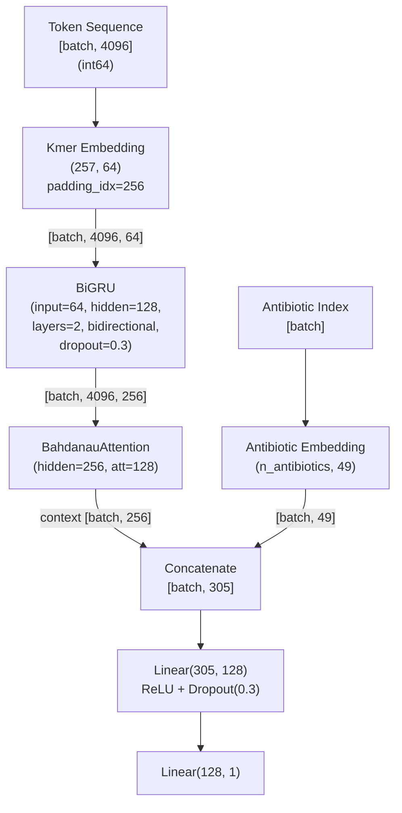

# Plan de Implementacion — Token BiGRU (AMRTokenBiGRU)

## Contexto y Motivacion

Los modelos actuales (MLP, BiGRU, Multi-BiGRU) representan los genomas como **histogramas de frecuencia de k-meros**: cuentan cuantas veces aparece cada k-mero en todo el genoma. Esta representacion de tipo "bag-of-words" tiene una limitacion fundamental: **pierde completamente el orden y la posicion** de los k-meros a lo largo de la secuencia genomica.

```
Representacion actual (histograma):
  Genoma: ...ACGTACGTNNACGT...
  k=4:    ACGT aparece 3 veces, CGTA 2 veces, ...
  Output: vector de frecuencias [3, 2, 0, 1, ...] (1344 dims)
          → NO se sabe donde aparecen los k-meros en el genoma

Representacion propuesta (tokens):
  Genoma: ...ACGTACGTNNACGT...
  k=4:    ACGT → 27, CGTA → 45, GTAC → 180, ACGT → 27, ...
  Output: secuencia de IDs [27, 45, 180, 27, ...] (seq_len tokens)
          → SE preserva el orden y el contexto posicional
```

La propuesta original del proyecto (proposal.md) anticipaba esta distincion:

> "Para la Red Profunda: Se utilizaran las secuencias crudas (o sus representaciones matematicas directas, como One-Hot Encoding) para aprovechar la capacidad de la red de extraer caracteristicas de forma automatica."

Los modelos BiGRU anteriores desviaron de esta intencion al reutilizar los histogramas como pseudo-secuencias. El modelo Token BiGRU corrige esto: la BiGRU procesa una **secuencia real de tokens** extraidos del genoma, donde cada token es un k-mero en su posicion original.

### Hipotesis

Una red profunda (BiGRU + Attention) que recibe la secuencia de k-meros como tokens — en lugar de un resumen estadistico — puede aprender:

1. **Patrones posicionales:** Genes de resistencia que aparecen en regiones especificas del genoma.
2. **Co-ocurrencias locales:** Combinaciones de k-meros vecinos que forman motivos asociados a resistencia (e.g., sitios de union de integrasa, cassettes de resistencia).
3. **Dependencias a largo plazo:** Elementos de insercion (IS elements) que flanquean genes de resistencia y estan separados por cientos/miles de bases.

Estos patrones son invisibles para un histograma de frecuencias pero accesibles para una RNN que procesa la secuencia en orden.

### Resultados actuales

| Modelo | F1 | Recall | AUC-ROC | Precision | Params | Representacion |
|---|---|---|---|---|---|---|
| MLP | 0.8600 | 0.9165 | 0.9035 | 0.8100 | ~710K | Histograma 1344D |
| BiGRU v2 | 0.8566 | 0.9032 | 0.8998 | 0.8146 | 177K | Histograma [1024, 3] |
| Multi-BiGRU | TBD | TBD | TBD | TBD | ~233K | Histograma (64, 256, 1024) |

**Objetivo:** Superar el MLP en F1 manteniendo Recall >= 0.90, demostrando que la informacion posicional aporta valor predictivo.

---

## Referencias bibliograficas

| Ref. | Cita | Relevancia |
|---|---|---|
| [Lugo21] | Lugo, L. & Barreto-Hernandez, E. (2021). *A Recurrent Neural Network approach for whole genome bacteria identification*. Applied Artificial Intelligence, 35(9), 642-656. | Arquitectura BiGRU+Attention base. Aunque usa histogramas, la BiGRU es directamente reutilizable con tokens. |
| [Haykin] | Haykin, S. (2009). *Neural Networks and Learning Machines*, 3a ed. Pearson. | Representacion del conocimiento (Cap. 7), RNNs (Cap. 15), embedding como mapeo de caracteristicas (Cap. 7.1), generalizacion (Cap. 4.11). |
| [Cho14] | Cho, K. et al. (2014). *Learning Phrase Representations using RNN Encoder-Decoder for Statistical Machine Translation*. EMNLP. | Unidad GRU. Originalmente disenada para secuencias de tokens (palabras) — exactamente nuestro caso de uso. |
| [Bahdanau15] | Bahdanau, D., Cho, K. & Bengio, Y. (2015). *Neural Machine Translation by Jointly Learning to Align and Translate*. ICLR. | Mecanismo de atencion aditiva sobre secuencias de tokens. |
| [Schuster97] | Schuster, M. & Paliwal, K. (1997). *Bidirectional Recurrent Neural Networks*. IEEE Trans. Signal Processing. | Bidireccionalidad: leer la secuencia genomica en ambas direcciones. |
| [Mikolov13] | Mikolov, T. et al. (2013). *Efficient Estimation of Word Representations in Vector Space*. ICLR Workshop. | Fundamento de los embeddings aprendidos: tokens discretos se mapean a vectores densos que capturan similitudes semanticas. Los k-meros juegan el rol de "palabras" y el genoma el de "documento". |
| [Goodfellow16] | Goodfellow, I., Bengio, Y. & Courville, A. (2016). *Deep Learning*. MIT Press. | Embeddings (Cap. 12.4), RNNs (Cap. 10), regularizacion (Cap. 7), optimizacion (Cap. 8). |
| [Pascanu13] | Pascanu, R. et al. (2013). *On the Difficulty of Training Recurrent Neural Networks*. ICML. | Gradient clipping para secuencias largas. |
| [Srivastava14] | Srivastava, N. et al. (2014). *Dropout: A Simple Way to Prevent Neural Networks from Overfitting*. JMLR. | Dropout como regularizacion. |
| [Kingma15] | Kingma, D. & Ba, J. (2015). *Adam: A Method for Stochastic Optimization*. ICLR. | Optimizador Adam. |
| [Compeau14] | Compeau, P. & Pevzner, P. (2014). *Bioinformatics Algorithms*. Active Learning Publishers, Cap. 9. | Codificacion 2-bit para k-meros, ya implementada en `features.py`. Se reutiliza para la tokenizacion. |

---

## Convencion de comentarios en el codigo

Igual que en `PLAN_BIGRU.md`:

1. **Docstrings de clase/metodo:** Describir arquitectura y referenciar fuentes con etiquetas (e.g., `[Mikolov13]`, `[Haykin, Cap. 7]`).
2. **Comentarios inline:** Explicar *por que* en cada paso no trivial, referenciando ecuacion o concepto.
3. **Constantes:** Justificar cada valor con su origen.
4. **Conexiones Haykin:** Referenciar el capitulo correspondiente donde aplique.

---

## Archivos a crear/modificar

> **Nota sobre la estructura real del proyecto:** El codigo fue refactorizado a un paquete
> `src/models/` con una clase base abstracta `BaseAMRDataset`. Los archivos reales difieren
> de la descripcion original del plan. La tabla a continuacion refleja la estructura implementada.

| Archivo | Accion |
|---|---|
| `src/data_pipeline/features.py` | **Modificar** — agregar metodo `to_token_sequence()` a `KmerExtractor` |
| `src/data_pipeline/pipeline.py` | **Modificar** — agregar `_extract_single_genome_tokens` y `_extract_and_save_tokens` |
| `src/data_pipeline/__init__.py` | **Modificar** — exportar `extract_and_save_tokens` (alias publico sin `_`) |
| `src/data_pipeline/constants.py` | **Modificar** — agregar `TOKEN_KMER_K`, `TOKEN_VOCAB_SIZE`, `TOKEN_PAD_ID`, `TOKEN_MAX_LEN`, `TOKEN_EMBED_DIM` |
| `src/models/base_dataset.py` | **Nuevo** — `BaseAMRDataset` abstracta con logica comun de carga de metadatos |
| `src/models/token_bigru/model.py` | **Nuevo** — `AMRTokenBiGRU` con embedding + BiGRU + Attention |
| `src/models/token_bigru/dataset.py` | **Nuevo** — `TokenBiGRUDataset(BaseAMRDataset)` que carga desde `token_bigru/` |
| `src/models/token_bigru/__init__.py` | **Nuevo** — init del subpaquete |
| `main.py` | **Modificar** — agregar comandos `prepare-tokens` y `train-token-bigru` |
| `tests/models/test_token_bigru.py` | **Nuevo** — tests unitarios del modelo |
| `tests/models/test_datasets.py` | **Modificar** — test de carga con `TokenBiGRUDataset` |
| `docs/*` | **Modificar** — ver seccion "Documentacion a actualizar" al final del plan |

---

## 1. Tokenizacion de k-meros (`src/data_pipeline/features.py` — modificacion)

### Concepto

En lugar de contar las ocurrencias de cada k-mero (histograma), emitimos la **secuencia ordenada de k-meros** tal como aparecen en el genoma. Cada k-mero se representa como su hash de 2 bits (el mismo que ya usamos para contar), produciendo un entero en el rango `[0, 4^k - 1]`.

```
Histograma (actual):              Tokens (propuesto):
  for base in sequence:             for base in sequence:
      ...                               ...
      if valid_count >= k:               if valid_count >= k:
          histogram[current] += 1            tokens.append(current)
```

La unica diferencia es `append` en lugar de `+= 1`. El rolling hash de 2 bits [Compeau14] se reutiliza exactamente como esta.

### Eleccion de k=4

| k | Vocab (4^k) | Expresividad | Embedding params (dim=64) |
|---|---|---|---|
| 3 | 64 | Baja: captura codones, poca diversidad | 4K |
| **4** | **256** | **Media: equilibrio expresividad/esparsidad** | **16K** |
| 5 | 1024 | Alta: pero muchos k-meros raros o ausentes | 65K |
| 6 | 4096 | Muy alta: embeddings muy dispersos | 262K |

**k=4** (vocabulario de 256 tokens) ofrece el mejor balance:
- Suficiente diversidad para codificar motivos biologicos (4 bases de contexto).
- Vocabulario manejable para una tabla de embeddings eficiente.
- Todos los 256 4-meros aparecen con frecuencia suficiente en genomas bacterianos (~2-5M bp) para aprender embeddings significativos.

**Conexion teorica:** En NLP [Mikolov13], vocabularios de 10K-100K tokens son comunes. Un vocabulario de 256 es muy compacto, lo que simplifica el aprendizaje de embeddings. Desde la perspectiva de la **Representacion del Conocimiento** [Haykin, Cap. 7], k=4 captura "features locales" del ADN — cuatro bases consecutivas que pueden formar parte de sitios de union, motivos reguladores, o extremos de genes de resistencia.

### Manejo de la longitud: subsampling uniforme

Los genomas bacterianos tipicos tienen ~2-5M de bases, generando ~2-5M tokens con stride=1. Una BiGRU no puede procesar secuencias tan largas por limitaciones de memoria y gradientes [Pascanu13].

**Estrategia: subsampling uniforme con longitud fija.**

```python
def to_token_sequence(self, k: int = 4, max_len: int = 4096) -> numpy.ndarray:
    """
    Extrae la secuencia de k-meros como tokens (IDs enteros).

    En lugar de contar frecuencias, emite la secuencia ordenada de k-meros
    tal como aparecen en el genoma [Mikolov13; Haykin, Cap. 7]. Cada k-mero
    se codifica con el rolling hash de 2 bits existente [Compeau14].

    Si la secuencia total excede max_len, se submuestrea uniformemente
    para mantener cobertura del genoma completo.

    Parametros:
        k: tamano del k-mero (default 4, vocab = 256)
        max_len: longitud maxima de la secuencia de salida

    Retorna:
        numpy.ndarray de shape (max_len,) con dtype int64.
        Valores en [0, 4^k - 1]. Si el genoma produce menos de max_len
        tokens, se rellena con un token de padding (4^k).
    """
    # 1. Extraer TODOS los tokens del genoma
    all_tokens = []
    sequences = self._read_sequences()
    mask = (4**k) - 1
    for sequence in sequences:
        current = 0
        valid_count = 0
        for base in sequence:
            base_index = BASE_TO_INDEX.get(base)
            if base_index is None:
                valid_count = 0
                current = 0
            else:
                current = ((current << 2) | base_index) & mask
                valid_count += 1
                if valid_count >= k:
                    all_tokens.append(current)

    total = len(all_tokens)

    # 2. Subsampling uniforme o padding
    if total >= max_len:
        # Seleccionar max_len posiciones uniformemente distribuidas.
        # numpy.linspace genera indices equidistantes que cubren todo el genoma.
        # Esto preserva la cobertura global, similar al downsampling uniforme
        # en procesamiento de senales [Haykin, Cap. 1.2].
        indices = numpy.linspace(0, total - 1, max_len, dtype=int)
        tokens = numpy.array(all_tokens, dtype=numpy.int64)[indices]
    else:
        # Padding con token especial (4^k) para secuencias cortas.
        # En la practica, genomas bacterianos de >= 500K bases producen
        # >> 4096 tokens, asi que este caso es raro.
        pad_token = 4**k  # 256 para k=4
        tokens = numpy.full(max_len, pad_token, dtype=numpy.int64)
        tokens[:total] = all_tokens

    return tokens
```

**Por que subsampling uniforme en vez de truncar:**
- **Truncar** (tomar los primeros N tokens) sesga hacia el inicio del genoma. En genomas bacterianos, los contigs no estan necesariamente ordenados biologicamente [Lugo21, p. 647: "invariant to the order of nodes in the FASTA"].
- **Subsampling uniforme** muestrea posiciones equidistantes del genoma completo, preservando cobertura global. Para un genoma de 2M bp con max_len=4096, se toma un token cada ~488 bases — suficiente para capturar genes de resistencia tipicos (~1000-2000 bp).
- **Subsampling aleatorio** (random sin reemplazo) daria cobertura similar pero no es determinista, lo que dificulta la reproducibilidad.

**Conexion teorica:**
- [Haykin, Cap. 7]: La tokenizacion es una forma de **Representacion del Conocimiento** que preserva la estructura secuencial de los datos, a diferencia del histograma que solo preserva estadisticas de primer orden.
- [Mikolov13]: Los embeddings aprendidos capturan relaciones semanticas entre tokens. En nuestro caso, k-meros biologicamente similares (e.g., que difieren en una base) deberian tener embeddings cercanos, emergiendo naturalmente del entrenamiento.
- [Cho14]: La GRU fue disenada explicitamente para procesar secuencias de tokens (palabras), no vectores de frecuencias. La tokenizacion devuelve la BiGRU a su uso idiomatico.

---

## 2. Pipeline de extraccion (`src/data_pipeline/pipeline.py` — modificacion)

### Nuevo paso: extraccion de tokens

Agregar una funcion `_extract_tokens` analoga a `_extract_kmers`, que genera las secuencias de tokens y las guarda en `data/processed/token_bigru/`:

```python
def _extract_single_genome_tokens(
    genome_id: str, fasta_dir: Path, k: int, max_len: int
) -> tuple[str, numpy.ndarray]:
    """Extrae secuencia de tokens de un solo genoma."""
    extractor = KmerExtractor(fasta_dir / f"{genome_id}.fna")
    # No se llama extract() — to_token_sequence() lee las secuencias directamente
    # via _read_sequences(). Llamar extract() aqui seria redundante (leer el FASTA
    # dos veces) ya que _read_sequences() no tiene cache.
    return genome_id, extractor.to_token_sequence(k=k, max_len=max_len)


def _extract_and_save_tokens(
    genome_ids: list[str],
    fasta_dir: Path,
    output_dir: Path,
    k: int = 4,
    max_len: int = 4096,
    n_jobs: int = 1,
) -> None:
    """Extrae secuencias de tokens de k-meros y las guarda como .npy."""
    logger.info(f"Step 7: Token extraction (k={k}, max_len={max_len})")
    token_dir = output_dir / "token_bigru"
    token_dir.mkdir(parents=True, exist_ok=True)

    worker = partial(
        _extract_single_genome_tokens, fasta_dir=fasta_dir, k=k, max_len=max_len
    )

    # Misma logica de paralelizacion que _extract_kmers
    if n_jobs == 1:
        for i, (genome_id, tokens) in enumerate(map(worker, genome_ids)):
            numpy.save(token_dir / f"{genome_id}.npy", tokens)
            logger.info(f"[{i + 1}/{len(genome_ids)}] Tokens extracted: {genome_id}")
    else:
        workers = max(1, int(os.cpu_count() * 0.8)) if n_jobs == -1 else n_jobs
        with concurrent.futures.ProcessPoolExecutor(max_workers=workers) as executor:
            futures = {executor.submit(worker, gid): gid for gid in genome_ids}
            for i, future in enumerate(concurrent.futures.as_completed(futures)):
                genome_id, tokens = future.result()
                numpy.save(token_dir / f"{genome_id}.npy", tokens)
                logger.info(f"[{i + 1}/{len(genome_ids)}] Tokens extracted: {genome_id}")
```

### Nota sobre normalizacion

Las secuencias de tokens **no requieren normalizacion z-score**. A diferencia de los histogramas (valores continuos de frecuencia), los tokens son IDs discretos que seran mapeados a vectores densos por la capa de embedding [Mikolov13; Goodfellow16, Cap. 12.4]. La "normalizacion" ocurre implicitamente en el espacio del embedding durante el entrenamiento.

### Integracion en `run_pipeline`

La extraccion de tokens se agrega como un paso adicional al pipeline existente, **sin modificar los pasos anteriores** (los histogramas MLP y BiGRU siguen generandose normalmente):

```python
def run_pipeline(
    labels_path, fasta_dir, output_dir, n_jobs=1,
    extract_tokens: bool = False,  # nuevo parametro
    token_k: int = 4,
    token_max_len: int = 4096,
) -> None:
    ...
    # Pasos 1-6 existentes (sin cambios)
    ...

    # Paso 7 (opcional): extraccion de tokens
    if extract_tokens:
        _extract_and_save_tokens(
            genome_list, fasta_dir, output_dir,
            k=token_k, max_len=token_max_len, n_jobs=n_jobs,
        )
```

Alternativamente, se puede exponer como un comando CLI separado `prepare-tokens` que opera sobre los genomas ya filtrados, evitando re-ejecutar todo el pipeline:

```python
@app.command()
def prepare_tokens(
    data_dir: Path = ...,
    fasta_dir: Path = ...,
    k: int = 4,
    max_len: int = 4096,
    n_jobs: int = 1,
) -> None:
    """Extrae secuencias de tokens de k-meros para el modelo Token BiGRU."""
    ...
```

**Recomendacion:** Implementar `prepare-tokens` como comando separado. Esto permite:
1. Experimentar con diferentes valores de `k` y `max_len` sin re-ejecutar el pipeline completo.
2. No modificar la firma de `run_pipeline`, preservando retrocompatibilidad.

### Constantes nuevas en `constants.py`

```python
# Tokenizacion de k-meros [Mikolov13; Compeau14]
TOKEN_KMER_K = 4                 # tamano del k-mero para tokenizacion
TOKEN_VOCAB_SIZE = 4 ** TOKEN_KMER_K  # 256 tokens validos
TOKEN_PAD_ID = TOKEN_VOCAB_SIZE  # 256 — token de padding (fuera del vocab)
TOKEN_MAX_LEN = 4096             # longitud maxima de la secuencia
TOKEN_EMBED_DIM = 64             # dimension del embedding de k-meros
```

---

## 3. Dataset (`src/models/token_bigru/dataset.py` — nuevo)

> **Nota sobre la estructura real:** El proyecto usa un patron de herencia con `BaseAMRDataset`
> (clase abstracta en `src/models/base_dataset.py`) que centraliza la logica comun de carga
> de metadatos. Cada modelo tiene su propio dataset que hereda de esta clase e implementa
> unicamente la carga de datos genomicos especifica.

### `BaseAMRDataset` (ya existe en `src/models/base_dataset.py`)

Maneja splits, labels, antibiotic_index y la construccion de listas de muestras. Delega la
carga de datos genomicos al metodo abstracto `_load_genome_data()`.

### `TokenBiGRUDataset(BaseAMRDataset)`

Solo necesita implementar `_load_genome_data()` para cargar tokens enteros:

```python
class TokenBiGRUDataset(BaseAMRDataset):
    def _load_genome_data(
        self, data_dir: Path, split_ids: set[str]
    ) -> dict[str, torch.Tensor]:
        """Carga secuencias de tokens (.npy) del directorio 'token_bigru/'."""
        vectors_dir = data_dir / "token_bigru"
        genome_data: dict[str, torch.Tensor] = {}
        for gid in split_ids:
            npy_path = vectors_dir / f"{gid}.npy"
            vec = numpy.load(npy_path)
            # Los tokens son IDs enteros para nn.Embedding [Mikolov13]
            genome_data[gid] = torch.from_numpy(vec).long()
        return genome_data
```

Los tokens se cargan como `torch.long` (enteros), no como `torch.float32`. El resto del
protocolo (`__len__`, `__getitem__`, `load_pos_weight`) lo provee `BaseAMRDataset`.

### Conexion teorica

- [Haykin, Cap. 7]: La representacion como secuencia de tokens es una **codificacion distribuida** donde cada token es un simbolo discreto que sera mapeado a un espacio continuo por el embedding.
- [Goodfellow16, Cap. 12.4]: Los embeddings aprendidos son la forma estandar de representar datos categoricos discretos (tokens) como entradas a redes neuronales.

---

## 4. Modelo (`src/token_bigru_model.py`)

### Arquitectura General



### Diferencia clave con los modelos anteriores

| Aspecto | BiGRU (histograma) | Token BiGRU |
|---|---|---|
| Input | `[batch, 1024, 3]` float32 | `[batch, 4096]` int64 |
| Primera capa | GRU directa (input_size=3) | **Embedding(257, 64)** → GRU (input_size=64) |
| Que procesa la GRU | Posiciones del histograma (sin orden biologico) | **Posiciones reales del genoma** |
| Seq len | 1024 (fijo, por padding) | 4096 (fijo, por subsampling) |
| La GRU aprende | Patrones entre bins de frecuencia | **Patrones secuenciales en el ADN** |

### 4.1 Constantes del modulo

```python
"""
AMRTokenBiGRU — Modelo BiGRU con tokenizacion de k-meros.

A diferencia de los modelos BiGRU anteriores que procesan histogramas de
frecuencia, este modelo recibe la secuencia de k-meros como tokens discretos
y aprende embeddings densos [Mikolov13]. Esto preserva el orden y contexto
posicional del genoma, permitiendo que la BiGRU capture patrones secuenciales
reales [Cho14; Schuster97].
"""

from data_pipeline.constants import (
    ANTIBIOTIC_EMBEDDING_DIM,
    TOKEN_VOCAB_SIZE,
    TOKEN_PAD_ID,
    TOKEN_EMBED_DIM,
)

# BiGRU [Cho14; Lugo21, p. 648]
GRU_HIDDEN_SIZE = 128            # Mismo que BiGRU original
GRU_NUM_LAYERS = 1               # Una capa recurrente
GRU_OUTPUT_DIM = GRU_HIDDEN_SIZE * 2  # 256 — forward + backward [Schuster97]

# Atencion [Bahdanau15]
ATTENTION_DIM = 128              # Dimension interna del espacio de atencion

# Clasificador
CLASSIFIER_HIDDEN = 128          # Capa densa tras concatenacion

# Regularizacion [Srivastava14]
DROPOUT = 0.3                    # Mismo que MEJORA1 — clasificador pequeno
```

### 4.2 Reutilizacion de `BahdanauAttention`

La clase `BahdanauAttention` de `bigru_model.py` se reutiliza directamente. Los argumentos son identicos al BiGRU original (`hidden_dim=256`, `attention_dim=128`) porque la BiGRU tiene el mismo `hidden_size=128`.

```python
from models.bigru.model import BahdanauAttention
```

### 4.3 `AMRTokenBiGRU(nn.Module)`

```python
class AMRTokenBiGRU(nn.Module):
    """
    Arquitectura BiGRU + Attention con tokenizacion de k-meros.

    A diferencia de AMRBiGRU que procesa histogramas [1024, 3], este modelo:
    1. Recibe una secuencia de token IDs [batch, seq_len] (enteros)
    2. Los mapea a embeddings densos via nn.Embedding [Mikolov13]
    3. Procesa la secuencia de embeddings con una BiGRU [Cho14; Schuster97]
    4. Comprime con atencion aditiva [Bahdanau15]
    5. Clasifica con la misma cabeza que los modelos anteriores

    Esto devuelve la BiGRU a su uso idiomatico: procesar secuencias de
    tokens discretos, como en NLP [Cho14; Bahdanau15], en lugar de
    recorrer bins de un histograma.

    Arquitectura:
        tokens [batch, 4096] → Embedding(257, 64) → [batch, 4096, 64]
        → BiGRU(128, layers=2, dropout=0.3) → [batch, 4096, 256] → Attention → ctx [batch, 256]
        → Concat(ab_emb [49]) → [batch, 305] → MLP → logit [batch, 1]
    """

    def __init__(self, n_antibiotics: int) -> None:
        super().__init__()

        # Embedding de k-meros: mapea tokens discretos a vectores densos [Mikolov13].
        # vocab_size = 257 (256 k-meros validos + 1 token de padding).
        # padding_idx=256: el token de padding se mapea al vector cero,
        # para que no contribuya a la representacion [Goodfellow16, Cap. 12.4].
        self.kmer_embedding = nn.Embedding(
            num_embeddings=TOKEN_VOCAB_SIZE + 1,  # 257
            embedding_dim=TOKEN_EMBED_DIM,         # 64
            padding_idx=TOKEN_PAD_ID,              # 256
        )

        # Embedding de antibiotico [Haykin, Cap. 7.1]
        self.antibiotic_embedding = nn.Embedding(
            n_antibiotics, ANTIBIOTIC_EMBEDDING_DIM
        )

        # BiGRU [Cho14; Schuster97; Lugo21, p. 648]
        # input_size=64 (dimension del embedding) en lugar de 3 (histograma)
        self.gru = nn.GRU(
            input_size=TOKEN_EMBED_DIM,      # 64
            hidden_size=GRU_HIDDEN_SIZE,     # 128
            num_layers=GRU_NUM_LAYERS,       # 1
            batch_first=True,
            bidirectional=True,
        )

        # Atencion aditiva [Bahdanau15]
        self.attention = BahdanauAttention(
            hidden_dim=GRU_OUTPUT_DIM,       # 256
            attention_dim=ATTENTION_DIM,     # 128
        )

        # Clasificador [Lugo21, p. 648; Goodfellow16, Cap. 14.4]
        # Entrada: 256 (contexto BiGRU) + 49 (embedding antibiotico) = 305
        self.classifier = nn.Sequential(
            nn.Linear(GRU_OUTPUT_DIM + ANTIBIOTIC_EMBEDDING_DIM, CLASSIFIER_HIDDEN),
            nn.ReLU(),
            nn.Dropout(DROPOUT),
            nn.Linear(CLASSIFIER_HIDDEN, 1),
        )

        # Almacen de pesos de atencion para interpretabilidad
        self._attention_weights: torch.Tensor | None = None

    def forward(self, tokens: torch.Tensor, antibiotic_idx: torch.Tensor) -> torch.Tensor:
        """
        Paso forward del modelo.

        Parametros:
            tokens: [batch, seq_len] — secuencia de token IDs (long)
            antibiotic_idx: [batch]

        Retorna:
            logits: [batch, 1]
        """
        # 1. Embedding: tokens discretos → vectores densos [Mikolov13]
        # [batch, 4096] → [batch, 4096, 64]
        x = self.kmer_embedding(tokens)

        # 2. BiGRU procesa la secuencia en ambas direcciones [Schuster97]
        # [batch, 4096, 64] → [batch, 4096, 256]
        gru_out, _ = self.gru(x)

        # 3. Atencion comprime la secuencia en un vector de contexto [Bahdanau15]
        # [batch, 4096, 256] → context [batch, 256], alpha [batch, 4096]
        context, attn_weights = self.attention(gru_out)
        self._attention_weights = attn_weights.detach()

        # 4. Fusion: contexto genomico + identidad del antibiotico
        ab_emb = self.antibiotic_embedding(antibiotic_idx)  # [batch, 49]
        x = torch.cat([context, ab_emb], dim=1)              # [batch, 305]

        # 5. Clasificacion final
        return self.classifier(x)

    @classmethod
    def from_antibiotic_index(cls, path: str) -> "AMRTokenBiGRU":
        """Factory method: lee n_antibiotics desde antibiotic_index.csv."""
        df = pandas.read_csv(path)
        return cls(n_antibiotics=len(df))
```

### Estimacion de parametros

| Componente | Parametros |
|---|---|
| Kmer Embedding (257 x 64) | ~16K |
| GRU (input=64, hidden=128, bidireccional) | 2 x 3 x (64 + 128 + 1) x 128 = ~148K |
| Attention (256 → 128 → 1) | 256 x 128 + 128 = ~33K |
| Antibiotic Embedding (96 x 49) | ~5K |
| Classifier (305 → 128 → 1) | 305 x 128 + 128 + 128 + 1 = ~39K |
| **Total** | **~241K** |

Comparable a los modelos anteriores (MLP ~710K, BiGRU ~177K, Multi-BiGRU ~233K). La capa de embedding anade solo ~16K parametros.

### Nota sobre la interfaz `forward`

La firma cambia de `forward(genome: FloatTensor, antibiotic_idx)` a `forward(tokens: LongTensor, antibiotic_idx)`. El tipo de tensor difiere, pero la interfaz posicional es la misma: `forward(genome_data, antibiotic_idx)`. El training loop no necesita cambios adicionales mas alla de los que ya maneja `isinstance(genome, (tuple, list))` del Multi-BiGRU.

### Interpretabilidad de la atencion

Con la tokenizacion, los pesos de atencion `[batch, 4096]` tienen un significado biologico directo: indican **que posiciones del genoma** (muestreadas) son mas relevantes para la prediccion. Esto es una mejora significativa respecto al BiGRU anterior, donde la atencion operaba sobre posiciones del histograma (bins de frecuencia sin significado posicional).

Se podria mapear los pesos de atencion de vuelta a coordenadas genomicas usando los indices de subsampling, permitiendo identificar regiones genomicas asociadas a resistencia.

### Conexion teorica

- **Embedding como representacion distribuida** [Haykin, Cap. 7; Mikolov13]: Cada k-mero de 4 bases tiene 256 posibles valores. El embedding mapea estos 256 simbolos discretos a un espacio continuo de 64 dimensiones donde k-meros biologicamente similares pueden aprender representaciones cercanas. Esto es analogo a como Word2Vec [Mikolov13] mapea palabras a vectores que capturan relaciones semanticas.
- **BiGRU sobre secuencia real** [Cho14; Schuster97]: La GRU fue disenada para modelar dependencias temporales en secuencias. Aplicarla a una secuencia real de tokens (donde el "tiempo" corresponde a la posicion en el genoma) es su uso canonico, a diferencia de aplicarla a bins de un histograma.
- **Atencion como selector de regiones genomicas** [Bahdanau15]: El mecanismo de atencion identifica que posiciones del genoma son informativas para la prediccion. Esto conecta con la biologia: los genes de resistencia ocupan regiones especificas y son detectables por sus k-meros caracteristicos.

---

## 5. Training Loop (`src/train/loop.py` — sin cambios)

El training loop existente **no requiere modificaciones**. El modelo Token BiGRU usa la misma interfaz `forward(genome_data, antibiotic_idx) → logits` que el BiGRU y el MLP. Los tokens son tensores regulares (no tuplas como en Multi-BiGRU), por lo que el `isinstance` check existente los maneja correctamente como caso `else`.

El unico cambio es que los tensores genomicos son de tipo `long` en vez de `float`, pero `.to(device)` funciona igual para ambos tipos.

**Gradient clipping:** Se debe pasar `max_grad_norm=1.0` al entrenar, igual que los otros modelos BiGRU. Con 4096 timesteps (vs 1024 del BiGRU original), el riesgo de gradientes explosivos es aun mayor [Pascanu13].

---

## 6. CLI (`main.py` — modificaciones)

### Nuevo comando `prepare-tokens`

```python
@app.command()
def prepare_tokens(
    data_dir: Path = typer.Option(
        Path("data/processed"),
        help="Directorio con outputs del pipeline (splits.csv, etc.).",
    ),
    fasta_dir: Path = typer.Option(
        Path("data/raw/fasta"),
        help="Directorio con archivos .fna de genomas.",
    ),
    k: int = typer.Option(TOKEN_KMER_K, "--k", help="Tamano del k-mero para tokenizacion"),
    max_len: int = typer.Option(TOKEN_MAX_LEN, "--max-len", help="Longitud maxima de la secuencia"),
    n_jobs: int = typer.Option(1, help="Procesos paralelos (-1 = 80% de los CPUs)."),
) -> None:
    """Extrae secuencias de tokens de k-meros para el modelo AMRTokenBiGRU.

    Requiere haber ejecutado prepare-data previamente. Lee los genome_ids
    del splits.csv existente y genera archivos .npy en token_bigru/.
    """
```

### Nuevo comando `train-token-bigru`

Sigue el patron exacto de `train-bigru`, con estas diferencias:

1. **Import:** `from token_bigru_model import AMRTokenBiGRU`
2. **Dataset:** `AMRDataset(data_dir, split="train", model_type="token_bigru")`
3. **Modelo:** `AMRTokenBiGRU.from_antibiotic_index(...)`
4. **Output dir default:** `Path("results/token_bigru")`
5. **Gradient clipping:** `max_grad_norm=1.0`
6. **pos_weight_scale:** heredar el default de 2.5 de MEJORA1

**Mismos argumentos CLI:**
- `--data-dir` (default: `data/processed`)
- `--output-dir` (default: `results/token_bigru`)
- `--epochs` (default: 100)
- `--batch-size` (default: 32)
- `--lr` (default: 0.001)
- `--patience` (default: 10)
- `--pos-weight-scale` (default: 2.5)

**Nota sobre batch size:** Con seq_len=4096 y embed_dim=64, la matriz de embeddings por batch es `[32, 4096, 64]` = 33.5 MB en float32. La BiGRU produce estados ocultos de `[32, 4096, 256]` = 134 MB. Esto es significativamente mas que el BiGRU anterior (`[32, 1024, 256]` = 33.5 MB). Si batch_size=32 causa OOM, reducir a `--batch-size 16`.

**Outputs en `results/token_bigru/`:**
- `best_model.pt`, `metrics.json`, `history.csv`, `history.png`, `params.json`

---

## 7. Tests (`tests/test_token_bigru.py`)

Seguir el patron de `tests/test_bigru.py`:

| Test | Descripcion |
|---|---|
| `test_output_shape` | `[batch, 1]` para batch sizes 1, 4, 32 con input `[batch, 4096]` long |
| `test_output_is_unbounded_logits` | Logits sin sigmoid (pueden ser < 0 o > 1) |
| `test_dropout_inactive_in_eval` | Salida determinista en `model.eval()` |
| `test_dropout_active_in_train` | Salida variable en `model.train()` |
| `test_attention_weights_shape` | `model._attention_weights.shape == [batch, 4096]` tras forward |
| `test_attention_weights_sum_to_one` | `attention_weights.sum(dim=1)` aprox 1.0 (softmax) |
| `test_embedding_padding` | `kmer_embedding(PAD_ID)` retorna vector cero |
| `test_embedding_output_shape` | `kmer_embedding(tokens).shape == [batch, seq_len, 64]` |
| `test_from_antibiotic_index` | Factory method lee CSV y crea modelo con n_antibiotics correcto |
| `test_input_dtype` | Modelo acepta tensores `long` y no `float` |

**Fixture:**

```python
_N_ANTIBIOTICS = 10

@pytest.fixture()
def model():
    return AMRTokenBiGRU(n_antibiotics=_N_ANTIBIOTICS)

@pytest.fixture()
def sample_input():
    batch_size = 4
    tokens = torch.randint(0, 256, (batch_size, 4096))
    ab_idx = torch.randint(0, _N_ANTIBIOTICS, (batch_size,))
    return tokens, ab_idx
```

### Modificacion a `tests/test_dataset.py`

Agregar test para `model_type="token_bigru"`:

```python
def test_token_bigru_shapes(token_bigru_dataset):
    """Verifica que model_type='token_bigru' retorna tensor long de shape (4096,)."""
    tokens, ab_idx, label = token_bigru_dataset[0]
    assert tokens.shape == (4096,)
    assert tokens.dtype == torch.long
    assert (tokens >= 0).all() and (tokens <= 256).all()  # 0-255 validos, 256 padding
```

---

## Decisiones fijas

| Parametro | Valor | Justificacion |
|---|---|---|
| k (tamano del k-mero) | 4 | Vocab=256: equilibrio expresividad/esparsidad; todos los 4-meros frecuentes en genomas bacterianos |
| Vocabulario | 257 (256 + 1 padding) | 4^4 = 256 k-meros validos + 1 token de padding |
| Embedding dim | 64 | Representacion densa suficiente para 256 tokens [Mikolov13] |
| padding_idx | 256 | Token de padding mapeado a vector cero |
| max_seq_len | 4096 | Practico para BiGRU; subsampling uniforme cubre el genoma completo |
| Subsampling | Uniforme (linspace) | Determinista, cobertura global, sin sesgo posicional |
| GRU hidden_size | 128 | Mismo que BiGRU original [Lugo21, p. 648] |
| Bidireccional | Si | [Schuster97] — leer el genoma en ambas direcciones |
| Atencion | Bahdanau, dim=128 | Reutilizada de `bigru_model.py` |
| Clasificador | 305 -> 128 -> 1 | Misma estructura que BiGRU (256 context + 49 ab embedding) |
| Gradient clipping | max_grad_norm=1.0 | [Pascanu13] — necesario para secuencias de 4096 timesteps |
| Datos | Directorio separado `token_bigru/` | No interfiere con histogramas existentes |

---

## Historial de hiperparametros de entrenamiento

### Iteracion 1 — configuracion base

**Resultado:** F1=0.8165, Recall=0.9066, AUC=0.8251. Early stopping en epoca 13.
**Diagnostico:** Overfitting severo desde epoca 1. train_loss=0.32 vs val_loss=1.02 en epoca 13. Mejor val F1 (0.809) en epoca 1. La red memorizaba el training set sin generalizar.

| Parametro | Valor | Justificacion |
|---|---|---|
| GRU capas | 1 | [Lugo21, p. 648] — arquitectura base |
| GRU dropout | — | No aplica con una sola capa (nn.GRU ignora el parametro) |
| Dropout clasificador | 0.3 | [Srivastava14; MEJORA1] |
| lr | 0.001 | Default Adam [Kingma15] |
| pos_weight_scale | 2.5 | [MEJORA1] — sesgar hacia recall |
| weight_decay | 0.0 | Sin regularizacion L2 |
| Parametros totales | 240K | — |

### Iteracion 2 — correccion de overfitting

**Motivacion:** El modelo de Iter. 1 overfitteo de forma inmediata (mejor modelo en epoca 1). Se identificaron tres causas: (1) sin regularizacion recurrente, (2) lr agresivo, (3) pos_weight_scale heredado del BiGRU sin justificacion para este modelo.

| Parametro | Valor anterior | Valor nuevo | Justificacion del cambio |
|---|---|---|---|
| GRU capas | 1 | **2** | Habilita dropout recurrente entre capas [Srivastava14]; nn.GRU requiere num_layers>=2 para aplicar dropout |
| GRU dropout | — | **0.3** | Regularizacion recurrente entre capas [Srivastava14] |
| lr | 0.001 | **0.0005** | Convergencia mas gradual; el modelo previo sobreajusto en <13 epocas |
| pos_weight_scale | 2.5 | **1.6** | pos_weight base=0.6299 (mayoria positiva); scale=1.6 da pw=1.00 (balance neutro). El 2.5 se heredo sin justificacion; Recall=0.9066 en Iter.1 sugiere que no se necesita tanta presion |
| weight_decay | 0.0 | **1e-4** | Regularizacion L2 en Adam [Goodfellow16, Cap. 7]; penaliza pesos grandes, reduce capacidad efectiva |
| Parametros totales | 240K | **535K** | La segunda capa GRU agrega capacidad, compensada por el dropout recurrente |

**Resultado Iter. 2:** F1=0.8121, **Recall=0.9567**, AUC=0.8190. Early stopping en epoca 13 (mejor val_loss en epoca 3). Overfitting reducido respecto a Iter. 1 (val_loss pico 0.75 vs 1.02) pero persistente. El Recall de 0.9567 es el valor mas alto de todo el proyecto.

---

## Analisis de resultados y limitaciones

### Diagnostico: por que el Token BiGRU no supera al MLP en F1

#### 1. El subsampling uniforme diluye la senal posicional

Los genes de resistencia antimicrobiana (ARGs) ocupan una fraccion minima del genoma:

| Elemento | Tamano tipico | % de un genoma de 4.5 Mbp |
|---|---|---|
| Gen individual (ej. *mecA*, *bla*KPC, *vanA*) | 800 – 2,000 bp | 0.02 – 0.04% |
| Cassette de resistencia (gen + promotor + IS elements) | 3,000 – 10,000 bp | 0.07 – 0.22% |
| Isla genomica de resistencia completa | 20,000 – 100,000 bp | 0.44 – 2.2% |

Con `max_len=4096` sobre un genoma de ~4.5M bp, el subsampling uniforme (linspace) toma un token cada **~1,100 bp**. A esa resolucion:

- Un gen individual de ~1,500 bp es cubierto por **1-2 tokens**. Si por azar el sampling no cae dentro del gen, este es invisible para el modelo.
- Un cassette de ~5,000 bp es cubierto por **4-5 tokens** — mejor, pero la BiGRU no puede distinguir la estructura interna (promotor → gen → terminador) con tan pocos puntos de muestreo.
- **Tokens consecutivos en la entrada estan separados ~1,100 bp en el genoma real.** La BiGRU asume que tokens adyacentes tienen relacion secuencial [Cho14], pero a esta resolucion los tokens vecinos pertenecen a regiones genomicas distantes e independientes.

#### 2. Por que los histogramas son superiores en este contexto

El histograma de k-meros es un **censo completo**: cuenta *todas* las ocurrencias de cada k-mero en todo el genoma, sin sampling. Si un gen de resistencia contiene k-meros caracteristicos (patrones de 4 bases que son frecuentes en ARGs pero raros en el resto del genoma), el histograma los captura con certeza.

```
Histograma (MLP):   Cobertura 100%, sin posicion     → F1 = 0.8600
Tokens (BiGRU):     Cobertura ~0.1%, posicion diluida → F1 = 0.8121
Ideal:              Cobertura 100%, posicion real     → Requiere seq_len ~millones
```

La informacion posicional (donde estan los genes, que tienen al lado) es biologicamente relevante — operones co-regulados, IS elements flanqueantes, contexto de promotor — pero el subsampling uniforme no tiene resolucion suficiente para capturarla. El resultado es un modelo que pierde tanto cobertura (vs histograma) como precision posicional (vs secuencia completa), quedando en un punto intermedio suboptimo.

#### 3. Evidencia de la inestabilidad del modelo

La curva de validacion de Iter. 2 muestra oscilaciones severas en val_recall:

| Epoca | val_recall | Interpretacion |
|---|---|---|
| 4 | 0.8704 | Modo "agresivo" — predice muchos positivos |
| 5 | 0.6800 | Modo "conservador" — colapsa |
| 6 | 0.8622 | Recupera |
| 7 | 0.6990 | Colapsa de nuevo |

Estas oscilaciones son atipicas y no se observan en los modelos basados en histograma. Sugieren que la senal que el modelo extrae de los tokens submuestreados es debil y ruidosa — pequenos cambios en los pesos causan grandes cambios en las predicciones porque el modelo opera cerca del ruido, no de una senal robusta.

#### 4. Hallazgo positivo: Recall = 0.9567

A pesar de las limitaciones, el Token BiGRU v2 logro el **Recall mas alto de todo el proyecto** (0.9567 vs 0.9165 del MLP). Esto indica que el modelo SI aprendio algo de la secuencia: es extremadamente sensible a cualquier senal de resistencia, a costa de precision (estimada ~0.70, generando mas falsos positivos). En un contexto clinico donde la prioridad absoluta es no dejar escapar organismos resistentes, este modelo seria el mas seguro.

### Conclusion: histograma vs secuencia para prediccion de AMR con BiGRU

| Representacion | Cobertura | Informacion posicional | F1 | Recall |
|---|---|---|---|---|
| Histograma k-meros (MLP) | Completa (censo) | Ninguna | **0.8600** | 0.9165 |
| Histograma → BiGRU + Att | Completa (censo) | Pseudo (orden de bins) | 0.8566 | 0.9032 |
| Tokens → BiGRU + Att | Parcial (sample 0.1%) | Diluida (~1100 bp entre tokens) | 0.8121 | **0.9567** |

Para este dataset (genomas ESKAPE, ~57K pares de entrenamiento), la composicion global de k-meros (que k-meros hay) es mas informativa que la posicion muestreada (donde estan algunos de ellos). La informacion posicional real — a escala de promotores (~100 bp), operones (~5,000 bp) e islas genomicas (~50,000 bp) — requiere resoluciones que exceden la capacidad de una BiGRU con recursos computacionales de un proyecto academico.

---

## Trabajo futuro: arquitecturas para informacion posicional a escala genomica

El analisis anterior identifica que el cuello de botella no es la arquitectura del clasificador (BiGRU + Attention funciona bien), sino la **representacion de entrada**: se necesita procesar secuencias mucho mas largas con resolucion suficiente para capturar la estructura posicional de los ARGs.

### Opcion A: Transformers con atencion sparse

Arquitecturas como **Longformer** [Beltagy et al., 2020] y **BigBird** [Zaheer et al., 2020] reemplazan la atencion O(n^2) por combinaciones de atencion local (ventana deslizante) + atencion global (tokens especiales), logrando O(n*k) con k = tamano de ventana. Esto permite procesar secuencias de ~16K-32K tokens.

| Aspecto | Evaluacion |
|---|---|
| Cobertura con 32K tokens | 1 token / ~140 bp — mejor que 4096, pero aun insuficiente para promotores (~100 bp) |
| Datos necesarios | Transformers desde cero son hambrientos de datos; 57K muestras es insuficiente para aprender embeddings + atencion + representacion de DNA simultaneamente |
| Implementacion | Alta complejidad: mascaras de atencion sparse, positional encoding para secuencias largas |
| Probabilidad de superar al MLP | Baja — el subsampling sigue siendo necesario y los datos son insuficientes para entrenamiento desde cero |

### Opcion B: Modelos de lenguaje genomico pre-entrenados

Modelos como **DNABERT-2** [Zhou et al., 2023], **HyenaDNA** [Nguyen et al., 2023] y **Nucleotide Transformer** [Dalla-Torre et al., 2023] son redes pre-entrenadas sobre millones de secuencias de DNA. Sus embeddings ya "entienden" la estructura del DNA, y solo requieren fine-tuning para tareas especificas.

| Modelo | Contexto max. | Pre-entrenamiento | Ventaja | Limitacion |
|---|---|---|---|---|
| DNABERT-2 | ~4K tokens (BPE) | Genomas multi-especie | Tokenizacion eficiente, ampliamente validado | Contexto limitado; requiere chunking para genomas completos |
| HyenaDNA | **1M+ nucleotidos** | Genoma humano | Escala sin precedentes; procesa ~25% de un genoma bacteriano en un forward pass | Pre-entrenado en humano, no bacteria — domain gap significativo |
| Nucleotide Transformer | ~6K tokens (6-mer) | **Genomas diversos incl. bacterias** | Pre-entrenamiento relevante al dominio | Contexto limitado (~36K bp); requiere chunking |

**Recomendacion para trabajo futuro:** El enfoque mas prometedor seria usar **Nucleotide Transformer como extractor de features** con procesamiento por ventanas: segmentar el genoma en chunks de ~6K tokens, obtener embeddings por ventana, y agregar esas representaciones con una BiGRU + Attention (reutilizando la infraestructura existente del proyecto). Esto combinaria embeddings pre-entrenados que entienden DNA bacteriano con la capacidad de atencion para identificar regiones relevantes, sin necesidad de procesar el genoma completo en un solo forward pass.

---

## Verificacion

1. `uv run pytest tests/test_token_bigru.py -v` — todos los tests pasan
2. `uv run pytest tests/test_dataset.py -v` — test de token_bigru dataset pasa
3. `uv run pytest` — todos los tests existentes siguen pasando (regresion)
4. `uv run python main.py prepare-tokens --help` — muestra ayuda correcta
5. `uv run python main.py prepare-tokens` — genera archivos en `data/processed/token_bigru/`
6. `uv run python main.py train-token-bigru --help` — muestra ayuda correcta
7. `uv run python main.py train-token-bigru --epochs 2` — smoke test (2 epocas)
8. `uv run python main.py train-token-bigru --epochs 100` — entrenamiento completo

---

## Riesgos y mitigaciones

| Riesgo | Impacto | Mitigacion |
|---|---|---|
| Secuencia de 4096 timesteps = alto uso de VRAM | OOM con batch_size=32 | Reducir a `--batch-size 16` o `--batch-size 8`; estados ocultos de `[batch, 4096, 256]` requieren ~4x mas memoria que el BiGRU original |
| Subsampling pierde informacion local | k-meros vecinos no son adyacentes en el genoma | Aceptable: cada token aun codifica 4 bases consecutivas; el objetivo es capturar patrones a nivel de regiones, no de bases individuales |
| Entrenamiento mas lento (4x mas timesteps) | Epocas mas largas | El forward/backward por batch sera ~4x mas lento que el BiGRU de 1024 timesteps; considerar reducir epochs o aumentar patience |
| Embeddings de k-meros no convergen | Vocabulario pequeno (256) con pocas epocas | 256 embeddings x 64 dims = 16K parametros; deberian converger rapido con genomas de millones de tokens |
| Gradientes explosivos en 4096 timesteps | Inestabilidad de entrenamiento | Gradient clipping max_grad_norm=1.0 [Pascanu13]; monitorear train_loss para detectar spikes |
| Subsampling uniforme no es optimo | Puede saltar regiones informativas | Alternativa futura: subsampling adaptativo o multiples ventanas; para v1, el uniforme es suficiente y determinista |

---

## Documentacion a actualizar

Los siguientes documentos deben actualizarse **al completar la implementacion**, sin sobreescribir el contenido existente de los modelos anteriores (MLP, BiGRU, Multi-BiGRU). Todos los cambios son **aditivos**.

| Documento | Cambio |
|---|---|
| `docs/PROGRESS.md` | Agregar **Fase 5 — Token BiGRU** con subtareas 5.1 (pipeline de tokenizacion), 5.2 (modelo), 5.3 (entrenamiento y evaluacion). |
| `docs/4_models.md` | Agregar seccion **Modelo D — Token BiGRU** al final, con arquitectura (diagrama mermaid), justificacion, y comandos CLI. Seguir el patron de los Modelos A, B y C existentes. |
| `docs/5_experiments.md` | Agregar **Experimento 4 — Token BiGRU** con comando, resultados y observaciones. Agregar fila a la tabla de Resultados Consolidados. |
| `docs/1_environment.md` | Agregar filas `prepare-tokens` y `train-token-bigru` a la tabla CLI. Agregar `token_bigru_model.py` y `data/processed/token_bigru/` a la estructura de carpetas. |
| `docs/CHANGELOG.md` | Agregar entrada con la fecha de implementacion al inicio del archivo, describiendo los cambios realizados (siguiendo el formato cronologico existente). |
| `main.py` (docstring) | Agregar `prepare-tokens` y `train-token-bigru` a la lista de comandos en el docstring del modulo (lineas 7-14). |

**Nota:** `docs/3_data_pipeline.md` podria necesitar una subseccion sobre la extraccion de tokens si se documenta el paso `prepare-tokens` como parte del pipeline de datos.

---

## Extensiones futuras (fuera del scope de este plan)

1. **max_len variable:** Experimentar con 2048, 4096, 8192 para encontrar el balance entre cobertura y costo computacional.
2. **k variable:** Probar k=3 (vocab=64) o k=5 (vocab=1024) y comparar.
3. **Multi-scale tokens:** Combinar tokens de k=3, k=4, k=5 en una sola secuencia (analogo a Multi-BiGRU pero con tokens en lugar de histogramas).
4. **Subsampling adaptativo:** Muestrear mas densamente regiones de alta complejidad genomica.
5. **Embeddings pre-entrenados:** Pre-entrenar embeddings de k-meros con un objetivo tipo Word2Vec [Mikolov13] sobre todos los genomas, antes del fine-tuning supervisado.
6. **Positional encoding:** Agregar informacion posicional explicita (como en Transformers) para complementar la informacion secuencial implicita de la GRU.
